# Bayesian Optimization for Unity

[](https://doi.org/10.5281/zenodo.16849778)

by [Pascal Jansen](https://scholar.google.de/citations?user=cR1_0-EAAAAJ&hl=en) and [Mark Colley](https://scholar.google.com/citations?user=Kt5I7wYAAAAJ&hl=de)

## About

This Unity asset provides an end-to-end, **Human-in-the-Loop (HITL) Multi-Objective Bayesian Optimization (MOBO)** workflow built on [botorch.org](https://botorch.org/). It lets you declare **design parameters** and **objectives** in Unity, handles a Python backend for MOBO, and loops with users inside your Unity scene. The result is an efficient search over large design spaces yielding trade-off designs on the **Pareto front**.

**Why this matters.** Users typically have diverse preferences, needs, and abilities. Thus, manual design parameter tuning is often slow and potentially biased; A/B and grid search scale poorly. Instead, MOBO uses probabilistic surrogate models and principled acquisition to balance design exploration and exploitation, **reducing the number of user trials** required to reach a high-quality design for every user.

#### Key Features
- Configure design parameters, objectives, and optimizer hyperparameters directly in Unity.
- Automatic, robust communication with a BoTorch-based MOBO process.
- Built-in integration with the [QuestionnaireToolkit](https://assetstore.unity.com/packages/tools/gui/questionnairetoolkit-157330) for explicit feedback in a HITL process; compatible with implicit telemetry.
- Automatic CSV logging of parameters, objectives, and hypervolume; warm-start from prior runs.
- Two example scenes demonstrating end-to-end optimization.

#### Example Use Case

To improve interface usability, treat selected UI attributes as **design parameters** $x$ (e.g., button size, color contrast, spacing, animation duration) and optimize two **objectives** $y$: **System Usability Scale** (0–100, maximize) and **task completion time** (seconds, minimize). In each iteration $t$, the optimizer proposes a configuration $x_t$; a participant completes a fixed task; Unity records time; the participant completes SUS; the posterior and acquisition function update; and the next $x_{t+1}$ is selected. After several iterations, the system returns an estimated Pareto front containing *Pareto-optimal* interface designs that represent the best compromise between the design objectives.


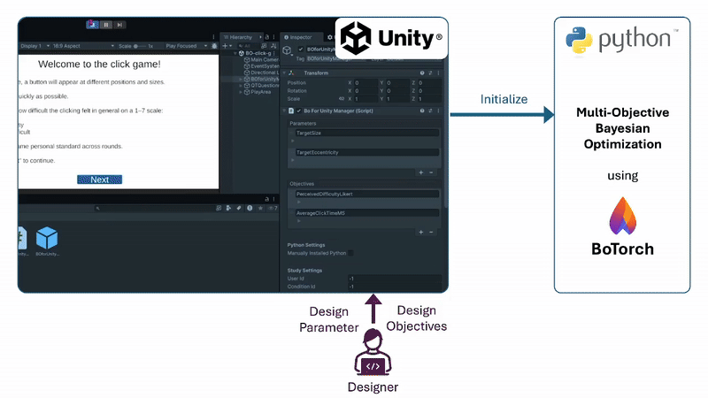


## Publications
Several scientific publications have used ‘Bayesian Optimization for Unity’ in their methodology:

- [OptiCarVis: Improving Automated Vehicle Functionality Visualizations Using Bayesian Optimization to Enhance User Experience](https://dl.acm.org/doi/full/10.1145/3706598.3713514)
(CHI '25, Best Paper Honorable Mention, top 5%)

- [Improving External Communication of Automated Vehicles Using Bayesian Optimization](https://dl.acm.org/doi/full/10.1145/3706598.3714187)
(CHI '25)

- [Fly Away: Evaluating the Impact of Motion Fidelity on Optimized User Interface Design via Bayesian Optimization in Automated Urban Air Mobility Simulations](https://dl.acm.org/doi/full/10.1145/3706598.3713288)
(CHI '25)


## Table of Contents
* [Background](#background)
* [Installation](#installation)
* [Example Usage](#example-usage)
* [Demo Video](#demo-video)
* [Configuration](#configuration)
    * [Parameters](#parameters)
    * [Objectives](#objectives)
    * [Python Settings](#python-settings)
    * [Study Settings](#study-settings)
    * [Problem Setup](#problem-setup)
    * [Optimization Budget](#optimization-budget)
    * [Model and Algorithm Hyperparameters](#model-and-algorithm-hyperparameters)
* [System Architecture](#system-architecture)
* [Portability to your own Project](#portability-to-your-own-project)
* [Citation](#citation)
* [License](#license)


## Background

### Optimization Problem

In MOBO, the goal is to find a parameter configuration (e.g., color, transparency, visibility) that maximizes objective values (e.g., usability, trust) while respecting the design space ($`X`$). The optimizer explores feasible designs to identify the best trade-offs among multiple objectives.

The optimization problem is:

$$
x^* = \arg\max_{x \in X} f(x),
$$

where:
- $x$ is a parameter vector in $X$,
- $f(x)$ is a vector of objectives, $f(x) = [f_1(x), f_2(x), \dots, f_k(x)]$,
- $x^*$ maximizes $f(x)$ over $X$.

Here, $f(x)$ is also denoted as $y$ and represents user responses to the system (e.g., questionnaire answers). The optimizer seeks the $x^*$ that yields the best outcomes.

### Human-in-the-Loop Process
The figure below shows the HITL process for this asset.
Step by step:
1. **Design Selection:**  
   The optimizer selects a design instance $x$ from the design space ($X$). In the example, a design includes color (ColorR, ColorG, ColorB), transparency, and visibility of the shapes (Cube & Cylinder). Parameter ranges limit $X$.
2. **Simulation:**  
   The appearance parameterized by $x$ is shown in the simulation so the user can experience the design.
3. **User Feedback:**  
   After the simulation, the user rates the design via a questionnaire. Ratings are translated into objective values $y$. In the example, the objectives are trust and usability, each with defined ranges ($Y$).
4. **Optimization:**  
   Based on current objective values, [MOBO](#multi-objective-bayesian-optimization-mobo) proposes another design, considering prior feedback. The loop repeats.

<a id="hitl_diagram"></a>

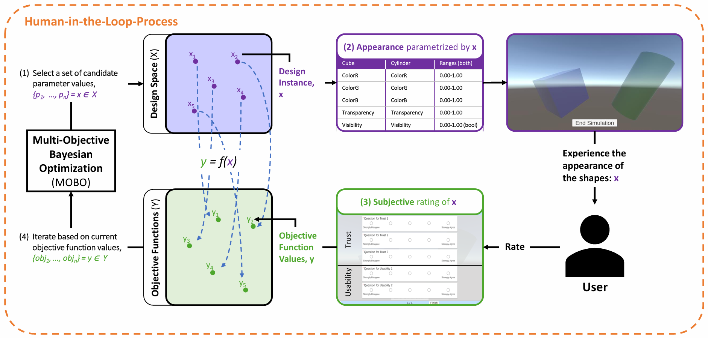

The entire process consists of two phases:

* **Sampling Phase:**\
Sobol sampling (see note) selects evenly spread designs across the space. The optimizer records objective values to learn the landscape before optimization starts. In these rounds, visual changes may not correlate with ratings.

> **Note:** I. M. Sobol. 1967. On the distribution of points in a cube and the approximate evaluation of integrals. U.S.S.R. Comput. Math. and Math. Phys. 7 (1967), 86–112. ([DOI](https://doi.org/10.1016/0041-5553(67)90144-9))

* **Optimization Phase:**\
The optimizer balances **exploitation** (refining known good regions) and **exploration** (searching new regions).


### Questionnaires for User Feedback
This asset uses the [QuestionnaireToolkit](https://assetstore.unity.com/packages/tools/gui/questionnairetoolkit-157330) to collect explicit subjective feedback. This feedback serves as a design objective in the HITL process.


### Results of Multi-Objective Bayesian Optimization (Pareto Front)

MOBO can optimize for multiple, potentially conflicting objectives. Rather than a single optimum, it identifies the **Pareto front**, representing the best trade-offs.

A solution is **Pareto optimal** if no other solution improves one objective without worsening another. The diagram below illustrates this.

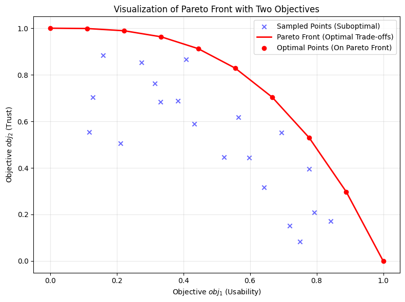

The x-axis shows the first objective (usability) and the y-axis the second (trust). As in the [HITL diagram](#hitl_diagram), both axes are objective values ($y$). Each point is one observed $y$ from ($Y$). Points on the curve are Pareto optimal; points inside are dominated.

MOBO uses surrogate models (e.g., Gaussian processes) to approximate objectives, enabling efficient prediction. An acquisition function (e.g., Expected Hypervolume Improvement) selects the next points, trading off performance gains and exploration.

In short, the optimizer maximizes $y$ by proposing parameter vectors expected to perform best next.

MOBO is used in hyperparameter tuning, materials discovery, and engineering design where multiple objectives matter.


## Installation
Set up the asset as follows:
1. Clone the repository.
2. Run `installation_python.bat` (Windows) or `install_python.sh` (macOS) to install Python and required libraries.  
   Files are in *Assets/StreamingAssets/BOData/Installation*.
3. Install Unity Hub.
4. Create or log in to your (student) Unity account.
5. Install Unity 2022.3.21f1 or higher. We recommend Unity 6.2 or newer.
6. Add the project to Unity Hub by selecting the repository folder.
7. Open the project and set the [Python Settings](#python-settings).

> **Note:** You may set the Python path manually if you already have a local Python installation. See [Python Settings](#python-settings). Also, read [Configuration](#configuration) to ensure settings are saved.


## Example Usage
This section walks through the demo experiment. Install the asset first as described in [Installation](#installation).
> **Note:** *ObservationPerEvaluation.csv* must be empty (except the header). Find it at *Assets/BOforUnity/BOData/BayesianOptimization/LogData/&lt;USER_ID&gt;/* (replace `<USER_ID>` as set in [Study Settings](#study-settings)). You can delete the folder to recreate a clean one.

1. In Unity, open *Assets/BOforUnity* and double-click *BO-example-scene.unity*.
2. Press the Play button (⏵).
3. Click `Next`, wait for loading, then click `Next` again.
4. The simulation appears. You will see up to two colored shapes to evaluate.
5. When finished, click `End Simulation`. A questionnaire appears.
6. Answer, then press `Finish`. The optimizer saves your input and updates parameters.
7. Press `Next` to start a new iteration. Repeat from step `3` until all iterations finish. The system then indicates you can close the application.

> **Note:** Results are in *Assets/BOforUnity/BOData/BayesianOptimization/LogData/&lt;USER_ID&gt;/* (replace `<USER_ID>`).


## Demo Video
Click the thumbnail for a short demo showing how to export the main-branch package and import it into a new Unity project. It also shows what to do after import if you have an up-to-date Python (currently, we recommend 3.13.5) on Windows. You can also open the video in the *images* folder.
> **Note:** This video shows a previous version of this asset's user interface in Unity. The procedure is similar for the current version.

[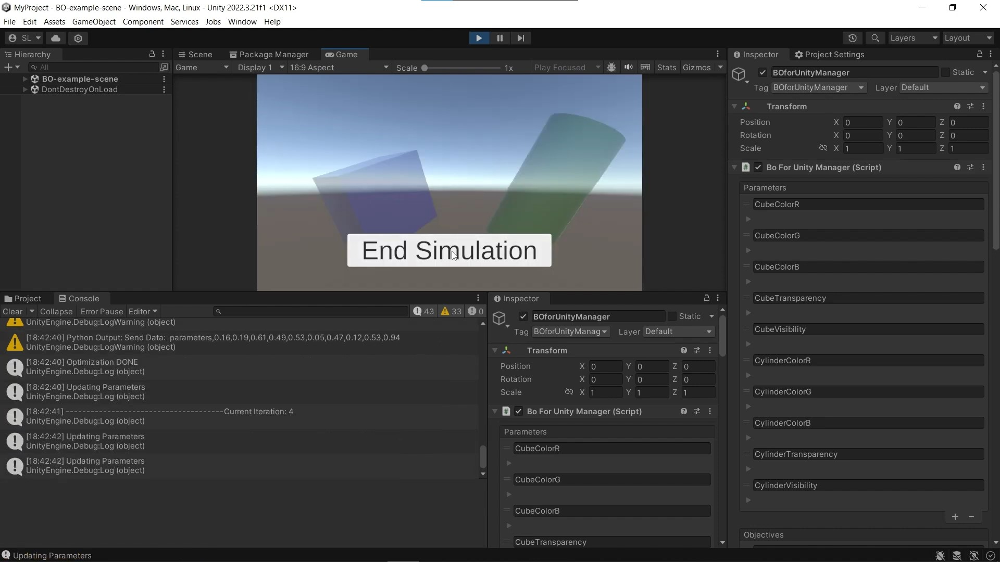](https://www.youtube.com/watch?v=J1hrFuiGiRI)

<!---->


## Configuration
All configuration is done in Unity. Open *Assets/BOforUnity/BO-example-scene.unity*. Select the *BOforUnityManager* object in the hierarchy, then click *Select* at the top of the inspector. Adjust settings as needed.

Save the scene after changes. Re-select *BOforUnityManager* to confirm your edits. The *BOforUnityManager* prefab must be correct; it overrides previous settings (see the inspector top left).

> **Note:** All configuration lives in this object. The options below follow the inspector from top to bottom.


### Parameters
Parameters are automatically adjusted by the system during optimization. This section shows how to create, change, or remove parameters before runtime.

##### Create Parameter
Click `+` at the bottom of the parameter list to add a prefilled entry, then edit it as described [here](#change-parameter).

> **Note:** Ensure the new parameter is used by your simulation.

> **Note:** Back up logs in *Assets/BOforUnity/BOData/BayesianOptimization/LogData/&lt;USER_ID&gt;/* (replace `<USER_ID>`) and delete the folder to refresh headers.

> **Note:** If you use the [warm start option](#warm-start-settings), ensure CSV headers match after adding parameters.

##### Change Parameter
Adjustable options, top to bottom:

| **Name**              | **Description**                                                                   |
|-----------------------|-----------------------------------------------------------------------------------|
| **Value**             | Value assigned by the optimizer in each sampling/optimization iteration.                                       |
| **Lower/Upper Bound** | Bounds that restrict the parameter.                                               |

> **Note:** You can read the current parameter values in each iteration directly from the parameter list in *BOforUnityManager* by index.
<a id="parameter_settings"></a>

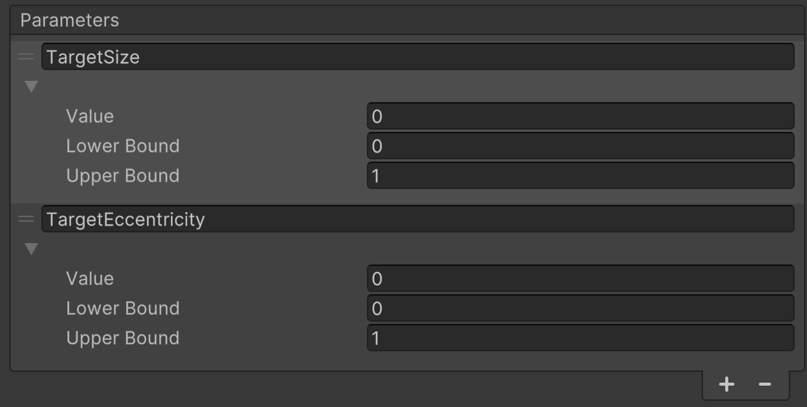

##### Remove Parameter
Select the parameter by clicking the `=` icon in its top-left corner (it turns blue). Click `-` at the bottom to remove it.

> **Note:** Ensure the removed parameter is **not** used in your simulation.

> **Note:** Back up and remove the log folder *Assets/BOforUnity/BOData/BayesianOptimization/LogData/&lt;USER_ID&gt;/* to refresh headers.


### Objectives
Objectives are sent to the optimizer as feedback in each iteration. You can create, change, or remove objectives.

##### Create Objective
Click `+` at the bottom of the objective list to add a prefilled entry, then edit it as described [here](#change-objective).

> **Note:** Each objective must receive a value before optimization. In the demo, create a new questionnaire item or map an existing one to the objective (see below).

> **Note:** Back up logs in *Assets/BOforUnity/BOData/BayesianOptimization/LogData/&lt;USER_ID&gt;/* and delete the folder to refresh headers.

> **Note:** For [warm start](#warm-start-settings), CSV headers must match after adding objectives.

###### Create Question
In *BO-example-scene* hierarchy, go to *QTQuestionnaireManager/QuestionPage-1*. In *Question Item Creation*, set the inputs (the *Header Name* must match the objective name), then click *Create Item*. Edit as needed.

###### Change Existing Question
In *QTQuestionnaireManager/QuestionPage-1/Scroll View/Viewpoint/Content/*, select the question and set its *Header Name* to the objective name.

##### Change Objective
Options, top to bottom:

| **Name**                       | **Description**                                                                                      |
|--------------------------------|------------------------------------------------------------------------------------------------------|
| **Number of Sub Measures**     | Number of values for this objective (e.g., count of questions). **Must be >= 1**.                           |
| **Values**                     | Values populated after the questionnaire is completed.                                               |
| **Lower/Upper Bound**          | Bounds that restrict the objective values.                                                           |
| **Smaller is Better**          | Whether lower values are preferable (default: higher is better).                                     |
<a id="objective_settings"></a>

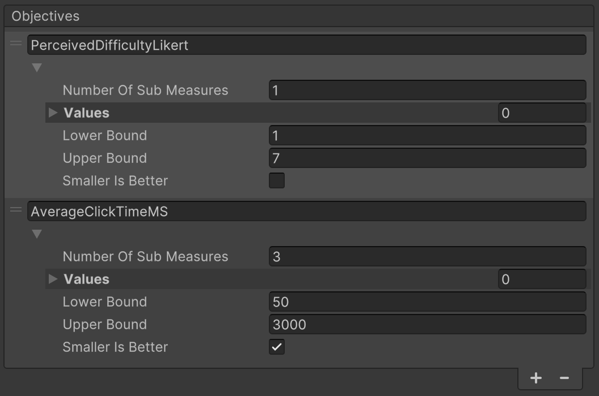

##### Remove Objective
Select the objective by clicking the `=` icon in its top-left corner (turns blue). Click `-` at the bottom to remove it.

> **Note:** Reverse the steps you performed when adding the objective.


### Python Settings
**Default**: 
If you leave `Manually Installed Python` unchecked, the system will automatically search for a valid Python path in the OS and install the requirements via pip.

You can **overwrite** this behavior by checking `Manually Installed Python` and following the steps below:
 1. Open a CMD window and search for all Python installations:
    * Windows: `where python`
    * Linux/macOS: `which python3`   
    Copy the path to the *newest* Python version shown.   
 2. In *BOforUnityManager* → *Python Settings*, check the box
 3. Paste the path in the `Path of Python Executable` field.

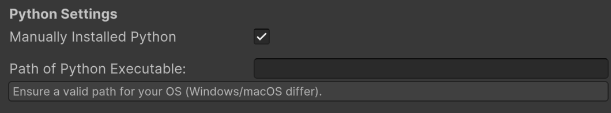


### Study Settings
Set `User ID`, `Condition ID`, and `Group ID` in the next section of the [image](#py_st_ws_pr_settings). 
If your study does not use any of these IDs, leave the field at -1. The value will still be logged, but you can ignore it in analysis.

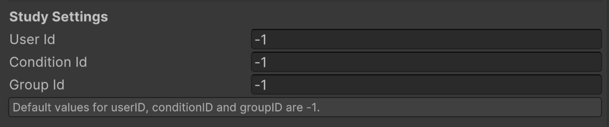


### Problem Setup
Here, the current setup of design parameters (d) and design objectives (m) is shown as defined in the parameter and objectives list in the inspector. This serves as an overview to decide the optimization budget below.


### Optimization Budget
These options are in the lower part of this [image](#py_st_ws_pr_settings).

##### Warm Start Settings
* Checking **Warm Start** skips the initial rounds. Optimization starts from prior results supplied as CSVs, formatted like the examples in *Assets/BOforUnity/BOData/BayesianOptimization/InitData*. Also, copy the prior *ObservationsPerEvaluation.csv* into the new study’s log folder (e.g., use *ExampleObservationsPerEvaluation.csv* as a template).
* Leaving it unchecked uses the default start. After the specified number of initial iterations (minimum 2), optimization begins using the collected values.

> **Note:** CSV formats for warm start **must** match the examples. Headers must match the current number of parameters and objectives. Using logs from a prior study with the same settings satisfies this.

##### Perfect Rating Settings
* Disabled by default.
* Enable **Perfect Rating** to terminate when a perfect rating is achieved.
* If **Perfect Rating In Initial Rounds** is checked (visible only when perfect rating is active), a perfect rating can also terminate during sampling.
<a id="py_st_ws_pr_settings"></a>

| **Name**       | **Default Value** | **Description**                                                                                   |
|-----------------|-------------------|---------------------------------------------------------------------------------------------------|
| **Sampling Iterations**   | [2d+1](https://botorch.org/docs/tutorials/multi_objective_bo/)                 | Number of sampling iterations before optimization; the recommended value is 2*Number of Design Parameters + 1. You can overwrite this default by checking `Set Sampling Iterations Manually`.                     |
| **Optimization Iterations**|                 | Number of iterations used to refine results; here, the actual optimization takes place.                       |
| **Total Iterations** |            | Sum of `Sampling Iterations` and `Optimization Iterations`. This is how long the HITL process will run in total.                                                           |

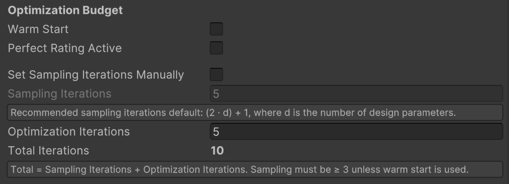


### Model and Algorithm Hyperparameters

The hyperparameters affect how efficiently the optimizer searches the space. The adjustable hyperparameters are shown in this [image](#BO_hyper_settings).

| **Name**       | **Default Value** | **Description**                                                                                   | **More Information**                                                                                                   |
|-----------------|-------------------|---------------------------------------------------------------------------------------------------|------------------------------------------------------------------------------------------------------------------------|    
| **Batch Size**  | 1                 | Number of evaluations performed in parallel.                                                      | [Batch Size Explanation](https://mljourney.com/how-does-batch-size-affect-training/)                                   |
| **Num Restarts**| 10                | Optimization restarts to escape local optima.                                                     |                                                                                                                        |
| **Raw Samples** | 1024              | Random samples to initialize acquisition optimization.                                            |                                                                                                                        |
| **MC Samples**  | 512               | Monte Carlo samples to approximate the acquisition function.                                      | [MC Samples Explanation](https://www.sciencedirect.com/topics/mathematics/monte-carlo-simulation)                      |
| **Seed**        | 3                 | Random seed for reproducibility.                                                                  | [Seed Explanation](https://en.wikipedia.org/wiki/Random_seed)                                                          |


> **Note:** **N Initial ≥ 2**. Use warm start if you want to skip sampling.
<a id="BO_hyper_settings"></a>

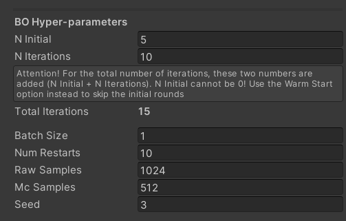


## System Architecture
This section explains the architecture to help you extend the asset. The diagram below summarizes the flow.

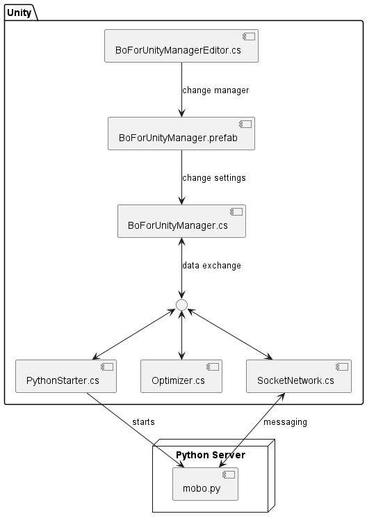

At the top is *BoForUnityManagerEditor.cs*, which edits the *BoForUnityManager.prefab* (what can be set and how it is described). The prefab’s settings are configured in the Unity Inspector as explained in [Configuration](#configuration).\
*BoForUnityManager.cs* manages the process and first starts the Python server via *PythonStarter.cs*.\
Once the server is running, *BoForUnityManager.cs* communicates with *mobo.py* using *SocketNetwork.cs*.\
After receiving data from *SocketNetwork.cs*, it passes it to *Optimizer.cs*, which updates simulation parameters.\
*BoForUnityManager.cs* also tracks the current iteration and orchestrates the loop.


## Portability to Your Own Project
To reuse this tool in another project, export it as a Unity package:
1. In the Unity hierarchy, ensure you are in *Assets*. 
2. `Assets` → **Export Package...**
3. Click **None** to deselect all files.
4. Select:
   - *BOforUnity*
   - *QuestionnaireToolkit*
   - *StreamingAssets*  
6. Click **Export...** and save the package. 

To import: `Assets` → **Import Package** → **Custom Package...**, select your package, keep all selected, and press **Import**.

> **Note:** Avoid spaces in the project path; otherwise, the Python script may not resolve paths correctly.

> **Note:** On first use of *TextMeshPro*, install *TextMeshPro-Essentials* when prompted. Refresh the scene if needed.


## Citation

If you use this software, please cite:

```bibtex
@software{jansen_bayesian_optimization_unity_2025,
  author    = {Pascal Jansen and Mark Colley},
  title     = {Bayesian-Optimization-for-Unity},
  year      = {2025},
  month     = aug,
  publisher = {Zenodo},
  version   = {v1.1.0},
  doi       = {10.5281/zenodo.16849778},
  url       = {https://doi.org/10.5281/zenodo.16849778}
}
```


## License
This project is under the **MIT License**, available in the repository folder containing this README.

\
\
<span style="color:gray">*README originally written by Sebastian Lommen as part of his student's software engineering project*</span>
