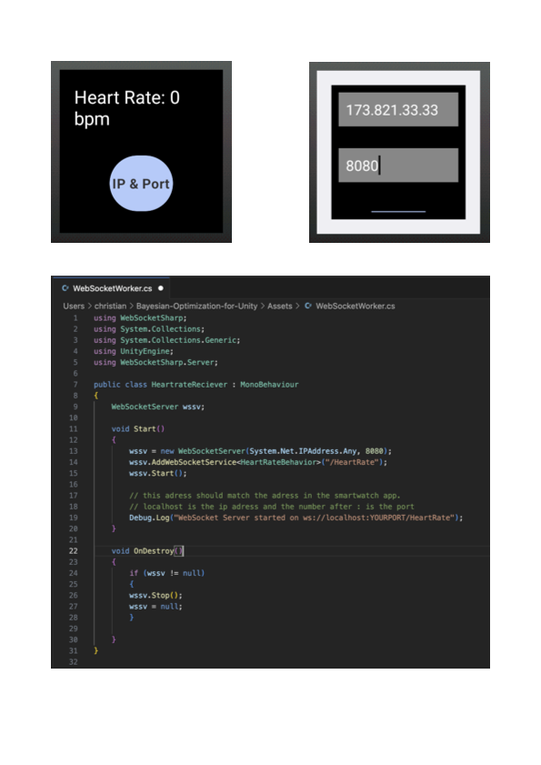

# Bayesian Optimization for Unity

This README file just contains additional information about this branch. For detailed information of the main system, look into the README file of the main branch

by [Christian Hummler]

## Table of Contents
* [About](#about)
* [Installation](#installation)
* [Example Usage](#example-usage)

## About

The folder called "HeartRateSender" contains an android studio project with a smartwatch app that was designed for the galaxy watch 4. This application opens a socket connection and can send heart rate information using this connection. 

#### Key Features
- Smart watch application that can send heart rate
- Unity script that can receive heart rate
- Easy inclusion of sensor data when using the optimizer

#### Usage

This enables the optimizer to use sensor data instead of user input. The applications can be expanded so that not only the heart rate, but any number of other sensors can be used in unity.

## Installation
These instructions are not intended to get the entire project up and running from the start. You must first follow the instructions in the README on the main branch. This guide is only for getting the additional files/functions of this branch to run. These are: Smartwatch app, unity script to recieve smartwatch data, altered optimizer

#### Smartwatch Application
The easiest way to install the application on your galaxy watch 4 is to open the android studio project and to use the device manager.

- Make sure that both devices (pc and watch) are connected to the same network. (open the terminal on your device and use ipconfig (windows)/ifconfig (mac os) to see the ip adress).
- On the watch, **locate developer options** and activate the option **"allow adb debugging".** (For the developer options to show, you might need additional steps depending on your device). 
- Open the device manager in android studio and choose **"pair device using wifi"**. Follow the steps to pair the watch. 
- Run the app and it should get installed on your watch. You can now also use the app without connecting to the computer.

#### Unity Script
There is a script in unity with the name HeartrateReceiver. 
- The script should be placed in an empty game object so that it is active. A socket connection for the smartwatch is established in the file. 
- It is important that the script is already running when the connection is established by the smartwatch. 
- In addition, the port and ip address defined in the script should be the same as those specified in the app. 

## Example Usage
This is a step by step explanation, of how to use the additional features provided here.

To receive data from the smartwatch in unity, you need to make sure you have the according C# script set up and it is running. In the script you can adjust the port where you want to receive the data. First, make sure your smartwatch and your computer are connected to the same network. After the application is open on the smartwatch, you can switch to another screen where the ip adress of the other device and the port is needed. These need to match the data of your other device. When all is set up correctly, you should see the heart rate data in the console of your running unity project.

