# Bayesian Optimization for Unity

[](https://doi.org/10.5281/zenodo.19786494)

**[Pascal Jansen](https://pascal-jansen.github.io)**, Ulm University

**[Mark Colley](https://m-colley.github.io)**, University College London

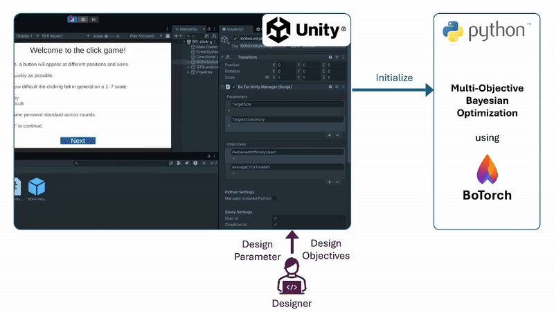

## About

This Unity asset provides an end-to-end, **Human-in-the-Loop (HITL) Bayesian Optimization** workflow (single- and multi-objective) built on [botorch.org](https://botorch.org/). It lets you declare **design parameters** and **objectives** in Unity, runs a Python backend, and loops with users inside your Unity scene. The result is an efficient search over large design spaces, yielding trade-off designs on the **Pareto front**.

**Why this matters.** Users typically have diverse preferences, needs, and abilities. Thus, manual design parameter tuning is often slow and potentially biased; A/B and grid search scale poorly. Instead, MOBO uses probabilistic surrogate models and principled acquisition to balance design exploration and exploitation, **reducing the number of user trials** required to achieve a high-quality design for individuals.

### Key Features

- Configure design parameters, objectives, and optimizer hyperparameters directly in Unity.
- Automatic, robust communication with a [BoTorch](https://botorch.org/)-based MOBO process.
- MOBO metric calculations use [moocore](https://github.com/multi-objective/moocore) for Pareto-front and hypervolume utilities.
- Cost-aware BO backend (CABOP) for cases where design evaluations have different costs, with single-objective and scalarized multi-objective modes; see Langerak et al.'s [Cost-Aware Bayesian Optimization for Prototyping Interactive Devices](https://dl.acm.org/doi/full/10.1145/3772318.3791024) for background.
- Dynamic BO backend (DBO) for single-objective studies whose cost **drifts during the session** (participant adaptation, learning, fatigue): the GP discounts past observations by a fitted temporal decay, with a one-toggle stationary baseline for matched control conditions; see Kim & Sergi's [Validation of Dynamic Bayesian Optimization for a Non-Stationary Human-in-the-Loop Optimization Problem](https://doi.org/10.1109/LRA.2026.3665072) for background.
- Contextual optimization with a latent context embedding multi-task GP (LCE-M; see Feng et al.'s [High-Dimensional Contextual Policy Search with Unknown Context Rewards using Bayesian Optimization](https://proceedings.neurips.cc/paper/2020/hash/faff959d885ec1ecf843a3f45087e047-Abstract.html), NeurIPS 2020): reuse observations from other contexts (users, devices, environments) with **definable context embeddings** — learned from data, supplied manually from any encoder, or computed from context images with an open_clip vision transformer such as ViT-G/14.
- Built-in integration with the [QuestionnaireToolkit](https://assetstore.unity.com/packages/tools/gui/questionnairetoolkit-157330) for explicit feedback in a HITL process; compatible with implicit telemetry.
- Automatic CSV logging of parameters/objectives and optimization metric traces (hypervolume for MOBO, best-objective trace for BO); warm-start from prior runs.
- Unified log routing below `Assets/StreamingAssets/BOData/LogData/<USER_LOG_ID>/<CONDITION_LOG_ID>/`, including QuestionnaireToolkit CSVs and app-specific telemetry.
- Ready-to-run example scenes, including questionnaire-driven design optimization and a 2D Fitts's law pointing task based on Fitts's [1954 paper](https://doi.org/10.1037/h0055392).
- Fitts law study support for `HITL MOBO`, `Static`, and `Random` conditions in one scene, with explicit design parameters, objective telemetry, and per-condition logs.

### Example Use Case

To improve interface usability, treat selected UI attributes as **design parameters** $x$ (e.g., button size, color contrast, spacing, animation duration) and optimize two **objectives** $y$: **System Usability Scale** (0–100, maximize) and **task completion time** (seconds, minimize). In each iteration $t$, the optimizer proposes a configuration $x_t$; a participant completes a fixed task; Unity records time; the participant completes SUS; the posterior and acquisition function update; and the next $x_{t+1}$ is selected. After several iterations, the system returns an estimated Pareto front containing *Pareto-optimal* interface designs that represent the best compromise between the design objectives.


<br>

## Publications

Several scientific publications have built upon **Bayesian Optimization for Unity**:

**2026**

[BlurDriving: Investigating How Personalized Blur Techniques Impact Drivers' Performance in Virtual Reality](https://dl.acm.org/doi/10.1145/3831646). In *Proceedings of the ACM on Interactive, Mobile, Wearable and Ubiquitous Technologies*, Vol. 10. **IMWUT**. ACM.

[Comparing Preferences Between Japan and Germany for External Communication of Automated Vehicles Using Bayesian Optimization](https://dl.acm.org/doi/10.1145/3831988). In *Proceedings of the ACM on Interactive, Mobile, Wearable and Ubiquitous Technologies*, Vol. 10. **IMWUT**. ACM.

[Multi-Session User Experience Assessments of Computationally Optimized Automated Vehicle Functionality Visualizations](https://dl.acm.org/doi/10.1145/3828157.3828785). In *Proceedings of the 18th International Conference on Automotive User Interfaces and Interactive Vehicular Applications*. **AutomotiveUI '26**. ACM.

[MoTUI: Personalization of In-Vehicle Tactile Interfaces for People With Vision Impairments and the Blind](https://pascal-jansen.github.io/data/publications/MoTUI.pdf). In *Proceedings of the 39th Annual ACM Symposium on User Interface Software and Technology*. **UIST '26**. ACM.

[ProVoice: Designing proactive functionality for in-vehicle conversational assistants using multi-objective Bayesian optimization to enhance driver experience](https://dl.acm.org/doi/full/10.1145/3772318.3791877). In *Proceedings of the 2026 CHI Conference on Human Factors in Computing Systems*. **CHI '26**. ACM.

**2025**

[OptiCarVis: Improving automated vehicle functionality visualizations using Bayesian optimization to enhance user experience](https://dl.acm.org/doi/full/10.1145/3706598.3713514). In *Proceedings of the 2025 CHI Conference on Human Factors in Computing Systems*. **CHI '25**. ACM.
  **Best Paper Honorable Mention (top 5%)**

[Improving external communication of automated vehicles using Bayesian optimization](https://dl.acm.org/doi/full/10.1145/3706598.3714187). In *Proceedings of the 2025 CHI Conference on Human Factors in Computing Systems*. **CHI '25**. ACM.

[Fly Away: Evaluating the impact of motion fidelity on optimized user interface design via Bayesian optimization in automated urban air mobility simulations](https://dl.acm.org/doi/full/10.1145/3706598.3713288). In *Proceedings of the 2025 CHI Conference on Human Factors in Computing Systems*. **CHI '25**. ACM.


<br>

## Contents

* [About](#about)
  * [Key Features](#key-features)
  * [Example Use Case](#example-use-case)
* [Publications](#publications)
* [1. Glossary](#1-glossary-plain-language)
* [2. Background](#2-background)
  * [2.1 Optimization Problem](#21-optimization-problem)
  * [2.2 Human-in-the-Loop Process](#22-human-in-the-loop-process)
  * [2.3 Questionnaires for User Feedback](#23-questionnaires-for-user-feedback)
  * [2.4 Results of Multi-Objective Bayesian Optimization](#24-results-of-multi-objective-bayesian-optimization-pareto-front)
* [3. Installation](#3-installation)
* [4. Integration Checklist](#4-integration-checklist-required)
* [5. Quick Start](#5-quick-start-10-minutes)
* [6. Example Usage](#6-example-usage)
  * [6.1 Questionnaire Demo Scene](#61-questionnaire-demo-scene)
  * [6.2 Fitts Law Task Scene](#62-fitts-law-task-scene)
    * [6.2.1 Condition Modes](#621-condition-modes)
    * [6.2.2 Design Parameters](#622-design-parameters)
    * [6.2.3 Objectives and Questionnaire Items](#623-objectives-and-questionnaire-items)
    * [6.2.4 Runtime Behavior](#624-runtime-behavior)
    * [6.2.5 Logging](#625-logging)
* [7. Demo Video](#7-demo-video)
* [8. Configuration](#8-configuration)
  * [8.1 Parameters](#81-parameters)
  * [8.2 Objectives](#82-objectives)
  * [8.3 Get Parameter Values via Code](#83-get-parameter-values-via-code)
  * [8.4 Set Objective Values via Code](#84-set-objective-values-via-code)
  * [8.5 Python Settings](#85-python-settings)
  * [8.6 Study Settings](#86-study-settings)
  * [8.7 Optimizer Backend and CABOP Settings](#87-optimizer-backend-and-cabop-settings)
  * [8.8 Questionnaire Prior Rating Hint](#88-questionnaire-prior-rating-hint-optional)
  * [8.9 Problem Setup](#89-problem-setup)
  * [8.10 Optimization Budget](#810-optimization-budget)
  * [8.11 Model and Algorithm Hyperparameters](#811-model-and-algorithm-hyperparameters)
  * [8.12 Output Files and Metrics](#812-output-files-and-metrics)
  * [8.13 Contextual Optimization and Context Embeddings (LCE-M GP)](#813-contextual-optimization-and-context-embeddings-lce-m-gp)
  * [8.14 Meta-BO (MetaTAF): Transfer from Prior Participants](#814-meta-bo-metataf-transfer-from-prior-participants)
  * [8.15 Dynamic BO (DBO): Optimizing a Drifting Objective](#815-dynamic-bo-dbo-optimizing-a-drifting-objective)
* [9. Troubleshooting](#9-troubleshooting)
* [10. System Architecture](#10-system-architecture)
* [11. Portability to Your Own Project](#11-portability-to-your-own-project)
* [12. Citation](#12-citation)
* [13. License](#13-license)

<br>

## 1. Glossary (Plain Language)

| Term | Meaning |
|---|---|
| **Parameter** | A setting Unity can change automatically (for example size, color, speed). |
| **Objective** | A score the optimizer tries to improve (for example usability, trust, completion time). |
| **Smaller is Better** | Unity flag for an objective where lower values are preferred (for example time or errors). |
| **Sampling Iterations** | Initial rounds used to explore the space before model-based optimization starts. |
| **Optimization Iterations** | Main BO rounds in which the model proposes the next-best design. |
| **Warm Start** | Start from existing CSV data instead of collecting new initial samples. |
| **Pareto Front** | Best trade-offs when you have multiple objectives and no single best point exists. |
| **Dominated Point** | A point that is worse than another point in all objectives (and strictly worse in at least one). |
| **Hypervolume** | Single MOBO progress metric computed from current non-dominated points in maximize-space. |
| **coverage** | Runtime metric sent from Python to Unity (`hypervolume` for MOBO, best objective for BO). |
| **tempCoverage** | Sampling-progress value in `[0,1]` during initial sampling rounds. |
| **USER_LOG_ID** | Folder-safe log identifier derived from `User ID` (invalid path characters are normalized). |
| **Seed** | Number used to make stochastic parts reproducible across runs with the same setup. |


<br>

## 2. Background

### 2.1 Optimization Problem

In MOBO, the goal is to find a parameter configuration (e.g., color, transparency, visibility) that maximizes objective values (e.g., usability, trust) while respecting the design space ($`X`$). The optimizer explores feasible designs to identify the best trade-offs among multiple objectives.

The optimization problem is:

$$
x^* = \arg\max_{x \in X} f(x),
$$

where:
- $x$ is a parameter vector in $X$,
- $f(x)$ is a vector of objectives, $f(x) = [f_1(x), f_2(x), \dots, f_k(x)]$,
- $x^*$ maximizes $f(x)$ over $X$.

Here, $f(x)$ is also denoted as $y$ and represents user responses to the system (e.g., questionnaire answers). The optimizer seeks the $x^*$ that yields the best outcomes.

### 2.2 Human-in-the-Loop Process

The figure below shows the HITL process for this asset.
Step by step:
1. **Design Selection:**
   The optimizer selects a design instance $x$ from the design space ($X$). In the example, a design includes color (ColorR, ColorG, ColorB), transparency, and visibility of the shapes (Cube & Cylinder). Parameter ranges limit $X$.
2. **Simulation:**
   The appearance parameterized by $x$ is shown in the simulation so the user can experience the design.
3. **User Feedback:**
   After the simulation, the user rates the design via a questionnaire. Ratings are translated into objective values $y$. In the example, the objectives are trust and usability, each with defined ranges ($Y$).
4. **Optimization:**
   Based on the current objective values, [MOBO](#24-results-of-multi-objective-bayesian-optimization-pareto-front) proposes another design that considers prior feedback. The loop repeats.

<a id="hitl_diagram"></a>

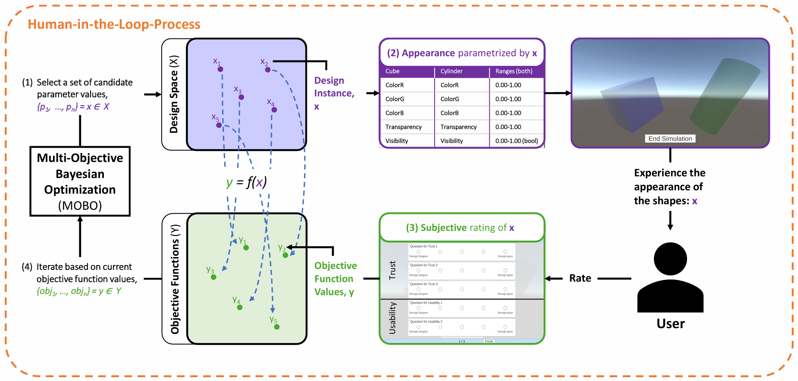

The entire process consists of two phases:

* **Sampling Phase:**\
Sobol sampling (see note) selects evenly spread designs across the space. The optimizer records objective values to learn the landscape before optimization starts. In these rounds, visual changes may not correlate with ratings.

> **Note:** I. M. Sobol. 1967. On the distribution of points in a cube and the approximate evaluation of integrals. U.S.S.R. Comput. Math. and Math. Phys. 7 (1967), 86–112. ([DOI](https://doi.org/10.1016/0041-5553(67)90144-9))

* **Optimization Phase:**\
The optimizer balances **exploitation** (refining known good regions) and **exploration** (searching new regions).


### 2.3 Questionnaires for User Feedback

This asset uses the [QuestionnaireToolkit](https://assetstore.unity.com/packages/tools/gui/questionnairetoolkit-157330) to collect explicit subjective feedback. This feedback serves as a design objective in the HITL process.

#### 2.3.1 Questionnaire Data Routing (Important)

- Only questionnaire question-item outputs are considered for BO objective updates (via objective-key/header matching).
- `additionalCsvItems` are written only to the questionnaire results CSV and are **not** forwarded to the BO manager/backend. `QTQuestionnaireManager` automatically adds `UserID`, `ConditionID`, and `GroupID` as additional CSV items so they are visible in the inspector and appear in every questionnaire CSV.
- `User ID`, `Condition ID`, and `Group ID` are not BO objectives. They are logged as context columns in `ObservationsPerEvaluation.csv`.
- Questionnaire result CSVs always include `UserID`, `ConditionID`, and `GroupID`. `QTQuestionnaireManager` reads them from `BoForUnityManager` when available; scenes without an active BO manager can set the fallback values in *QTQuestionnaireManager* -> *BO Context Logging*.
- Final-design selection uses the full context triad (`User ID`, `Condition ID`, `Group ID`) when filtering candidate observation rows.
- The bundled `QTQuestionnaireManager` now defaults its `resultsSavePath` to `Assets/StreamingAssets/BOData/LogData/`, and writes results below `LogData/<USER_LOG_ID>/<CONDITION_LOG_ID>/`, so raw QuestionnaireToolkit CSV output stays with the BO logs instead of `persistentDataPath`. (In installed builds where StreamingAssets is read-only, this default follows the BO logs to `<persistentDataPath>/BOData/LogData/`; see [8.12](#812-output-files-and-metrics).)
- Typed numeric answers accept `.` or `,` as decimal separator (`3.5`, `3,5`). Non-numeric answers are submitted as NaN and ignored for the objective (the scale midpoint is used only if none of its sub-measures is numeric).
- In app scenes that use the Fitts law task, `speed` and `accuracy` are added as extra questionnaire CSV columns. They are telemetry columns for analysis consistency; the BO objective values still come from the task script and the subjective questionnaire items.
- Do not create `UserID`, `ConditionID`, `GroupID`, `speed`, or `accuracy` as normal questionnaire questions. They should be Additional CSV Items only.


### 2.4 Results of Multi-Objective Bayesian Optimization (Pareto Front)

MOBO can optimize for multiple, potentially conflicting objectives. Rather than a single optimum, it identifies the **Pareto front**, representing the best trade-offs.

A solution is **Pareto optimal** if no other solution improves one objective without worsening another. The diagram below illustrates this.

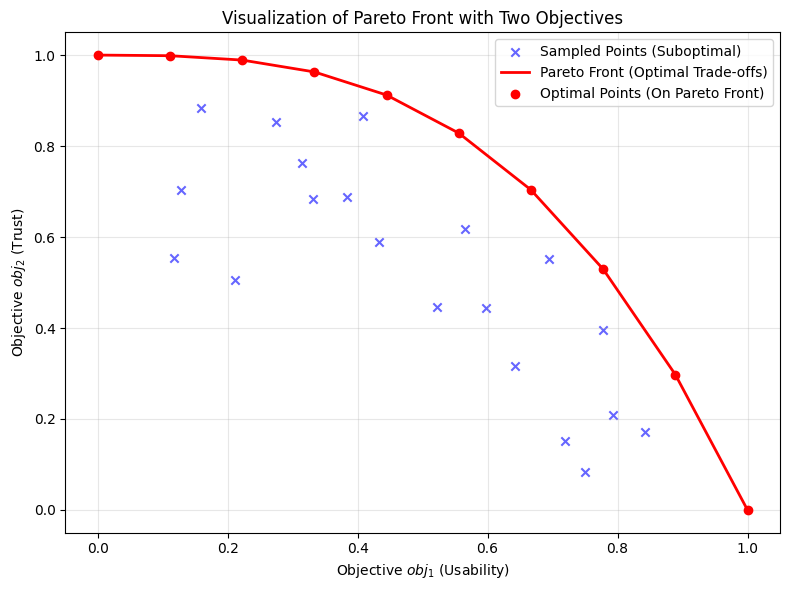

The x-axis shows the first objective (usability) and the y-axis the second (trust). As in the [HITL diagram](#hitl_diagram), both axes are objective values ($y$). Each point is one observed $y$ from ($Y$). Points on the curve are Pareto optimal; points inside are dominated.

MOBO uses surrogate models (e.g., Gaussian processes) to approximate objectives, enabling efficient prediction. An acquisition function (e.g., Expected Hypervolume Improvement) selects the next points, trading off performance gains and exploration.

In short, the optimizer maximizes $y$ by proposing parameter vectors expected to perform best next.

MOBO is used in hyperparameter tuning, materials discovery, and engineering design where multiple objectives matter.

<br>

## 3. Installation

Set up the asset as follows:
1. Clone the repository.
2. Optional: run `Windows/installation_python.bat` (Windows), `MacOs/install_python.sh` (macOS) or `Linux/install_python.sh` (Ubuntu/Debian) to install Python 3.13 ahead of time.
   Files are in *Assets/StreamingAssets/BOData/Installation*. On Windows and macOS, Unity also installs the bundled Python 3.13 by itself when it finds none.
   The scripts no longer install the Python packages: Unity installs them on the first Play into its own private environment (one time, a few minutes; see [Python Settings](#85-python-settings)).
3. Install Unity Hub.
4. Create or log in to your (student) Unity account.
5. Install Unity 2022.3.21f1 or higher. We recommend Unity 6.2 or newer.
6. Add the project to Unity Hub by selecting the repository folder.
7. Open the project and set the [Python Settings](#85-python-settings).

> **Note:** You may set the Python path manually if you already have a local Python installation or virtual environment. See [Python Settings](#85-python-settings). Also, read [Configuration](#8-configuration) to ensure settings are saved.

> **Note (updating from 1.8.0 or earlier):** the first Play after the update installs the Python packages once more, into the private environment. Packages you installed yourself (openbo for MetaTAF, `open_clip_torch`/`pillow` for image embeddings) must be installed again with the interpreter the Console logs at startup as `Optimizer Python: …`.

<br>

## 4. Integration Checklist (Required)

Before running your own scene, verify the following minimum setup:

1. `BOforUnityManager` object exists in the scene and has the tag `BOforUnityManager`.
2. The same object contains these components:
   - `BoForUnityManager`
   - `PythonStarter`
   - `SocketNetwork`
   - `Optimizer`
   - `MainThreadDispatcher`
3. In `BoForUnityManager`, required references are assigned:
   - `Output Text`
   - `Loading Obj`
   - `Welcome Panel`
   - `Optimizer State Panel`
   - `Progress Text` (optional): shows `Iteration x / N` whenever a design is ready.
4. If `Iteration Advance Mode = NextButton`, `Next Button` is assigned and wired to `BoForUnityManager.ButtonNextIteration()`.
5. If `Iteration Advance Mode = ExternalSignal`, your UI/game logic calls:
   ```csharp
   BoForUnityManager.Instance.RequestNextIteration(); // the running manager
   ```
6. Every objective key in `BoForUnityManager` has a matching data source (questionnaire item or manual script assignment).
7. If you use QuestionnaireToolkit mapping, each question `Header Name` matches the objective key exactly.
8. Parameter and objective keys are unique (no duplicates). The inspector lists configuration errors in red under the objective list; the study refuses to start while any remain.
9. Python settings are valid (`Manually Installed Python` path or automatic detection works).

If any item above is missing, the loop may start but stall before sending/receiving valid optimization data.


<br>

## 5. Quick Start (10 Minutes)

Use this path for a first successful run with the provided demo scene.

1. Open `Assets/BOforUnity/Scenes/BO-example-scene.unity`.
2. Select `BOforUnityManager` in the hierarchy and verify the [Integration Checklist](#4-integration-checklist-required).
3. In `BoForUnityManager` inspector:
   - keep `Iteration Advance Mode = NextButton`
   - keep `Warm Start = false`
   - keep `Seed = 3`
4. Set `Optimizer Backend = BoTorch` and confirm there are at least two objectives (`m >= 2`) so `mobo.py` is used.
5. Press Play.
6. Click `Next` to start initialization.
7. Wait for "The system has been started successfully!".
8. Click `Next` to start an evaluation.
9. Run the simulation flow and click `End Simulation`.
10. Complete the questionnaire and click `Finish`.
11. Repeat at least one more iteration.

Expected successful outcome:
- Parameter values in the scene change between iterations.
- `Assets/StreamingAssets/BOData/LogData/<USER_LOG_ID>/<CONDITION_LOG_ID>/` is created.
- `ObservationsPerEvaluation.csv` and `ExecutionTimes.csv` are populated.
- For MOBO (`m >= 2`), `HypervolumePerEvaluation.csv` is written and Unity receives `coverage` updates.

If these outputs appear, your full Unity-Python loop is working.


<br>

## 6. Example Usage

This section walks through the provided example workflows. Install the asset first as described in [Installation](#3-installation).
> **Note:** *ObservationsPerEvaluation.csv* must be empty (except for the header). Find it below *Assets/StreamingAssets/BOData/LogData/&lt;USER_LOG_ID&gt;/&lt;CONDITION_LOG_ID&gt;/*. By default these equal `User ID` and `Condition ID`, but invalid path characters are normalized for folder safety. You can delete the condition folder to recreate clean logs.

### 6.1 Questionnaire Demo Scene

Use this scene when you want to see the standard QuestionnaireToolkit-based HITL workflow.

1. In Unity, open *Assets/BOforUnity/Scenes* and double-click *BO-example-scene.unity*.
2. Press the Play button (⏵).
3. Click `Next`, wait for loading, then click `Next` again.
4. The simulation appears. You will see up to two colored shapes to evaluate.
5. When finished, click `End Simulation`. A questionnaire appears.
6. Answer, then press `Finish`. The optimizer saves your input and updates parameters.
7. Press `Next` to start a new iteration. Repeat from step `3` until all iterations finish. The system then indicates you can close the application.

> **Note:** Results are in *Assets/StreamingAssets/BOData/LogData/&lt;USER_LOG_ID&gt;/&lt;CONDITION_LOG_ID&gt;/* (typically your `User ID` and `Condition ID`, normalized for folder-safe naming if needed).

### 6.2 Fitts Law Task Scene

Use `Assets/BOforUnity/Scenes/BO-fitts-law-task.unity` for all Fitts law study conditions. The task presents circular click targets arranged on a ring. One target is highlighted at a time, contains an `X` marker, and the participant clicks the highlighted target to advance to the next trial. The implementation lives in `Assets/BOforUnity/Examples/FittsLawTask.cs`; condition orchestration lives in `Assets/BOforUnity/Examples/FittsLawConditionManager.cs`.

The scene now covers all three study conditions in one scene. Separate static/random scenes are not needed.

#### 6.2.1 Condition Modes

The scene contains a `FittsLawConditionManager`. Set its `Condition Mode` in the inspector:

| Condition Mode | Behavior |
|---|---|
| `HITL MOBO` | Adaptive BO design. The BO manager stays active, Python proposes new parameter values, and the questionnaire advances the BO loop through `ExternalSignal`. |
| `Static` | Fixed design. The BO runtime is disabled and the serialized values on `FittsLawTask` are used for every round. |
| `Random` | Random baseline. The BO runtime is disabled and a fresh random design is sampled for every task round. |

When `Set Condition ID From Mode` is enabled, the manager writes these condition IDs automatically:

| Condition Mode | ConditionID |
|---|---|
| `HITL MOBO` | `HITL MOBO` |
| `Static` | `static` |
| `Random` | `random` |

For static and random runs, configure `UserID` and `GroupID` on `FittsLawConditionManager`. The manager mirrors all three IDs into `QTQuestionnaireManager` at runtime, so questionnaire CSVs, app telemetry, and BO logs share the same context columns. The same `UserID` can be reused across condition modes; a suffix is added only when that specific condition folder already exists.

For static and random conditions, `FittsLawConditionManager` reads the same sampling/optimization iteration counts as the BO setup and runs one additional local `finaldesign` round when `includeFinalDesignRound` is enabled. This keeps the baseline conditions aligned with the adaptive BO condition while keeping the optimizer inactive. For example, with `3` sampling iterations and `2` optimization iterations, static/random run `5 + 1 finaldesign` task rounds.

#### 6.2.2 Design Parameters

The scene is configured as a BO example with five scalar design parameters:

| Parameter key | Default bounds | Meaning |
|---|---:|---|
| `x_font_size` | `18..64` | Font size of the fixed `X` marker inside the target, in pixels. |
| `button_size` | `40..120` | Target button diameter in pixels. This replaces the old `circle_size` parameter. |
| `button_distance` | `464..760` | Movement distance / ring diameter in pixels. This replaces the old `circle_distance` parameter. |
| `button_hue` | `0..1` | Button color hue in HSB/HSV space. |
| `button_saturation` | `0..1` | Button color saturation in HSB/HSV space. |

Brightness is intentionally not optimized. `FittsLawTask.buttonColorBrightness` is fixed at `0.5` and applied together with `button_hue` and `button_saturation`.

The Fitts law task only applies BO values whose keys are present in the `BoForUnityManager.parameters` list. Removing a key from that inspector list leaves the corresponding Fitts law value fixed at the value serialized on `FittsLawTask`. This is intentional: visual/task settings should not change unless they are explicitly defined as design parameters in the BO inspector. The task never writes the rendered layout back into the manager's parameters: they keep the design the optimizer suggested, which is the design Python records the observation under. In the static and random conditions (no optimizer), the configured or sampled design is mirrored into the matching entries.

Other Fitts visual properties, such as target count, target order, movement direction, target outline, background, and wrong-click flash, are not BO design parameters in the provided setup. The target outline is disabled by default (`targetOutlineWidth = 0`), and wrong-target red flashing is disabled by default (`wrongTargetFlashSeconds = 0`).

`button_distance` is constrained so adjacent targets cannot overlap. For the default `targetCount = 12` and maximum `button_size = 120`, the lower bound is `464 px` because the ring diameter must be at least `button_size / sin(pi / targetCount)`. If the window is too small for a design (targets would overlap or leave the play area), the rendered layout is shrunk to fit. The design itself is not changed: the optimizer still attributes the round to it, the rendered values are logged as `AppliedButtonSizePixels`/`AppliedButtonDistancePixels` (`AppliedLayoutAdjusted = TRUE`), and a warning is printed. Run the study at the reference resolution (1920 × 1080) or larger to avoid this.

The random condition samples from the configured `BoForUnityManager.parameters` entries when they are present, writes the sampled values back to those entries, and applies the matching Fitts law fields to the task. With the provided scene this means the same five ranges listed above are sampled. If the BO parameter list is unavailable, the task falls back to its own serialized random ranges. Static runs likewise mirror the serialized Fitts task values into matching manager entries. Brightness remains fixed at `0.5`.

#### 6.2.3 Objectives and Questionnaire Items

The scene writes four objectives:

| Objective key | Direction | Meaning |
|---|---|---|
| `aesthetics` | Maximize | Single-item aesthetics rating. |
| `speed` | Minimize | Raw total task time in ms, configured with bounds `0..30000`. |
| `accuracy` | Minimize | Raw mean click distance to the current target center in pixels, configured with bounds `0..1300`. |
| `usability` | Maximize | Average of the two usability slider items, for example `usability1` and `usability2`. |

Unity writes raw objective values to `BoForUnityManager`; the BO backend normalizes them using the objective lower/upper bounds from the inspector. The speed upper bound uses 30,000 ms because the default task has 10 trials, making 3 seconds per click the upper range before backend clamping. The accuracy upper bound uses 1300 px, derived from the default 1920 x 1080 reference resolution, 120 x 96 play-area padding, and max ring diameter of 760 px; this covers the farthest relevant click-to-target-center distance in the default task layout.

Speed and accuracy should therefore be configured in raw units in the Unity inspector. Do not pre-normalize them in Unity; the Python backend performs normalization from the configured objective bounds.

The subjective questionnaire items must be created manually in the scene. `FittsLawTask` does not create or duplicate QuestionnaireToolkit items at runtime. Use QuestionnaireToolkit slider items whose `Header Name` values match the objective keys. For multi-item objectives, use submeasure headers such as `usability1` and `usability2`; these map to the single `usability` objective and are averaged according to its `numberOfSubMeasures`. No additional UMUX-LITE or SUS regression formula is applied by the task; if you want a specific transformed scale, configure the questionnaire item scale/objective bounds accordingly.

The Fitts questionnaire result CSV also includes `speed` and `accuracy` as Additional CSV Items. This makes static, random, and HITL MOBO questionnaire files comparable, even though speed and accuracy are measured by the task script rather than answered by the participant.

#### 6.2.4 Runtime Behavior

Correct target selections advance to the next target. Following ISO 9241-9, a selection is registered when the mouse button is pressed (`Selection Event = Pointer Down`, the default); choose `Pointer Click` to register on release instead, as in versions up to 1.8.0 (movement times then include the release delay). Wrong target clicks and play-area misses are logged and counted, but they do not advance the trial. Wrong target flashing is disabled in the provided scene.

With `Target Selection Mode = Across Circle`, the highlighted target jumps across the ring. For an odd target count the order is the ISO 9241-9 sequence (step (n + 1) / 2), so every movement has the same amplitude; for an even count (the provided scene uses 12) consecutive movements alternate between the ring diameter D and D · cos(180° / n) (0.966 · D for 12 targets). Use an odd target count (e.g. 13) for ISO 9241-9 throughput analyses.

`Restart With Key` (R) is a debugging aid, off by default: it restarts a running round only and requires the legacy Input Manager.

Workflow:

1. Open `Assets/BOforUnity/Scenes/BO-fitts-law-task.unity`.
2. Select `Fitts Law Condition Manager` and set `Condition Mode`.
3. Press Play.
4. For `HITL MOBO`, wait for the optimizer to initialize. For `Static` and `Random`, the local condition starts without Python optimization.
5. Click each highlighted target until the trial block is complete.
6. Rate aesthetics and usability.
7. In `HITL MOBO`, the script writes objective values to `BoForUnityManager`, starts optimization, and requests the next external-signal iteration automatically. In `Static` and `Random`, `FittsLawConditionManager` starts the next local round after the questionnaire.

#### 6.2.5 Logging

The Fitts law scene also writes detailed app telemetry to `Assets/StreamingAssets/BOData/LogData/<USER_LOG_ID>/<CONDITION_LOG_ID>/`. `FittsLawAppLog.csv` stores one aggregate row per task round, including the ID triad, timestamp, iteration, phase, click counts, timing, accuracy, active design parameters, and objective values. `FittsLawTrialLog.csv` stores one row per completed target trial with the same context columns plus target/click positions and per-trial wrong-click counts. If the optional legacy `writeResultsCsv` flag is enabled, that CSV is written to the same condition folder.

`Iteration` in both files is the `Iteration` of the same evaluation in `ObservationsPerEvaluation.csv` (also under warm start, and for the final-design round), so the files join on it. The design columns (`ButtonSizePixels`, …) hold the design as suggested; `AppliedButtonSizePixels`/`AppliedButtonDistancePixels` the rendered layout. The `*Objective` columns hold the values sent to the optimizer (clamped to the objective bounds); raw measurements are in `TaskCompletionTimeMs` and `MeanCenterDistancePixels`. Values are written with full (round-trip) precision.

Each `FittsLawAppLog.csv` row also reports the ISO 9241-9 metrics of the round (the first trial is excluded because it starts from an arbitrary cursor position): `IsoWidthPixels` (W), `IsoAmplitudePixels` (D), `IsoID` = log2(D/W + 1), `IsoEffectiveAmplitudePixels` (De), `IsoEffectiveWidthPixels` (We = 4.133 × SD of the endpoint deviations along the task axis), `IsoIDe` = log2(De/We + 1), `IsoMovementTimeMs` (MT) and `IsoThroughputBitsPerSecond` (TP = IDe / MT), plus `IsoTrialCount` and the `SelectionEvent` in use. `FittsLawTrialLog.csv` adds the per-trial `AmplitudePixels`, `EndpointDeviationPixels` (positive = overshoot), `EffectiveAmplitudePixels` and `IncludedInIsoMetrics`. These metrics are for analysis only; the optimizer receives the `speed` and `accuracy` objectives as before. If a log file from an earlier version has different columns, new rows go to `FittsLawAppLog_1.csv` (etc.) next to it.

> **Note:** A trial ends only when the target is hit, so every ISO endpoint is a hit and the movement time (`ClickTimeMs`) of a trial with misses includes the correction. Compared with a protocol in which the first click ends the trial (misses become error trials), We is smaller and TP larger. Report the miss counts (`WrongClicksBeforeHit`) next to TP.

All files for one participant run are grouped under one user folder and then separated by condition:

```text
Assets/StreamingAssets/BOData/LogData/
  <USER_LOG_ID>/
    HITL MOBO/
      Questionnaire-*.csv
      FittsLawAppLog.csv
      FittsLawTrialLog.csv
      run/ObservationsPerEvaluation.csv
    static/
      Questionnaire-*.csv
      FittsLawAppLog.csv
      FittsLawTrialLog.csv
    random/
      Questionnaire-*.csv
      FittsLawAppLog.csv
      FittsLawTrialLog.csv
```

If the requested user folder already contains a folder for the same condition, BOforUnity creates a suffix such as `<USER_LOG_ID>_1`, `<USER_LOG_ID>_2`, and so on. A user folder that only holds other conditions is reused, so one participant's condition folders stay together. This prevents accidental overwrites.

This example is useful for HCI experiments where movement amplitude, button size, marker size, button color, objective pointing performance, and subjective single-item ratings should be optimized together. For the original model, see Fitts's 1954 paper, [The Information Capacity of the Human Motor System in Controlling the Amplitude of Movement](https://doi.org/10.1037/h0055392).

<br>

## 7. Demo Video

Click the thumbnail for a short demo showing how to export the main-branch package and import it into a new Unity project. It also shows what to do after import if you have an up-to-date Python (currently, we recommend 3.13.7) on Windows. You can also open the video in the *images* folder.
> **Note:** This video shows a previous version of the user interface for this asset in Unity. The procedure is similar for the current version.

[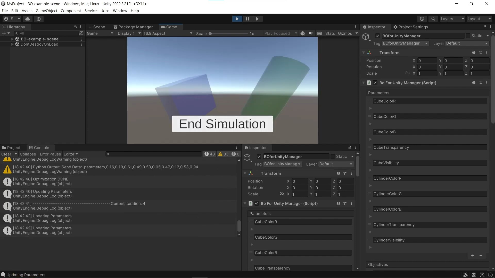](https://www.youtube.com/watch?v=J1hrFuiGiRI)

<!---->

<br>

## 8. Configuration

All configuration is done in Unity. Open *Assets/BOforUnity/Scenes/BO-example-scene.unity*. Select the *BOforUnityManager* object in the hierarchy, then click *Select* at the top of the inspector. Adjust settings as needed.

Save the scene after changes. Re-select *BOforUnityManager* to confirm your edits. The *BOforUnityManager* prefab must be correct; it overrides previous settings (see the inspector top left).

> **Note:** All configuration lives in this object. The options below are listed from top to bottom.
> **Note:** If you add or remove parameters/objectives, back up and clear the current user log folder to regenerate CSV headers.


### 8.1 Parameters

Parameters are automatically adjusted by the system during optimization. This section shows how to create, change, or remove parameters before runtime.

#### 8.1.1 Create Parameter

Click `+` at the bottom of the parameter list to add a prefilled entry, then edit it as described [here](#812-adjust-parameter-in-the-unity-inspector).

> **Note:** Ensure the new parameter is used by your simulation.

> **Note:** If headers are out of sync, back up logs in *Assets/StreamingAssets/BOData/LogData/&lt;USER_LOG_ID&gt;/&lt;CONDITION_LOG_ID&gt;/* and then delete the condition folder to refresh headers.

> **Note:** If you use the [warm start option](#8101-warm-start-settings), ensure CSV headers match after adding parameters.

#### 8.1.2 Adjust Parameter in the Unity Inspector

Adjustable options, top to bottom:

| **Name**              | **Description**                                                                   |
|-----------------------|-----------------------------------------------------------------------------------|
| **Value**             | Value assigned by the optimizer in each sampling/optimization iteration.          |
| **Lower/Upper Bound** | Bounds that restrict the parameter. Lower must be below Upper (every backend refuses equal bounds at startup); to keep a parameter fixed, remove it from the optimizer and set it in the scene. |
| **CABOP Group**       | Parameter group used by CABOP for group-wise cost modeling (`default` if empty). |
| **CABOP Tolerance**   | Reuse tolerance for CABOP, as a **fraction of the parameter's range** (`0`–`1`; default `0.05` = 5 % of Upper − Lower). A proposal this close to an earlier design reuses it (`unchanged`/`swapped` cost) instead of acquiring a new one. |
| **CABOP Prefabricated Values** | Optional discrete values for CABOP snapping (nearest value is used). Must lie within the parameter's bounds. |

<a id="parameter_settings"></a>
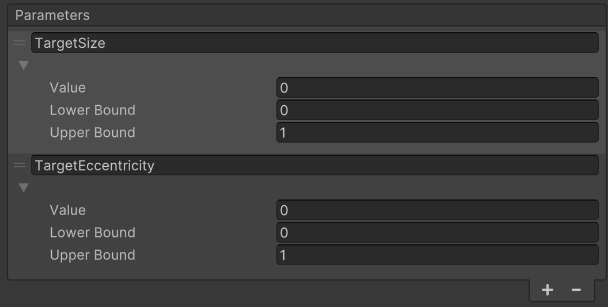

#### 8.1.3 Remove Parameter

Select the parameter by clicking the `=` icon in its top-left corner (it turns blue). Click `-` at the bottom to remove it.

> **Note:** Ensure the removed parameter is **not** used in your simulation.

> **Note:** If headers are out of sync, back up and remove the condition log folder *Assets/StreamingAssets/BOData/LogData/&lt;USER_LOG_ID&gt;/&lt;CONDITION_LOG_ID&gt;/*.


### 8.2 Objectives

Objectives are sent to the optimizer as feedback in each iteration. You can create, change, or remove objectives.

#### 8.2.1 Create Objective

Click `+` at the bottom of the objective list to add a prefilled entry, then edit it as described [here](#822-change-objective).

> **Note:** Each objective must receive a value before optimization. In the demo, create a new questionnaire item or map an existing one to the objective (see below).

> **Note:** If headers are out of sync, back up logs in *Assets/StreamingAssets/BOData/LogData/&lt;USER_LOG_ID&gt;/&lt;CONDITION_LOG_ID&gt;/* and then delete the condition folder.

> **Note:** For [warm start](#8101-warm-start-settings), CSV headers must match after adding objectives.

##### 8.2.1.1 Create Question

In *BO-example-scene* hierarchy, go to *QTQuestionnaireManager/QuestionPage-1*. In *Question Item Creation*, set the inputs (the *Header Name* must match the objective name), then click *Create Item*. Edit as needed.

##### 8.2.1.2 Change Existing Question

In *QTQuestionnaireManager/QuestionPage-1/Scroll View/Viewpoint/Content/*, select the question and set its *Header Name* to the objective name.

#### 8.2.2 Change Objective

Options, top to bottom:

| **Name**                       | **Description**                                                                                      |
|--------------------------------|------------------------------------------------------------------------------------------------------|
| **Number of Sub Measures**     | Number of values for this objective (e.g., count of questions). **Must be >= 1**. The objective value is the mean of the numeric values among the last N submitted; when more arrive (e.g. more questionnaire items match the key), the older ones are ignored and a warning says how many. |
| **Values**                     | Values populated after the questionnaire is completed.                                               |
| **Lower/Upper Bound**          | Bounds that restrict the objective values. Lower must not be above Upper; use **Smaller is Better** to flip the direction. |
| **Smaller is Better**          | Whether lower values are preferable (default: higher is better).                                     |
| **CABOP Weight**               | Weight used only in CABOP multi-objective scalarization (must be `> 0`).                            |

> **Note:** Parameter and objective keys must be unique, non-empty, distinct from each other, and must not equal a fixed log column (`UserID`, `ConditionID`, `GroupID`, `Timestamp`, `Iteration`, `Phase`, `IsBest`, `IsPareto`, and `Context` with contextual optimization; case-insensitive). The inspector lists violations (and other settings the backend would crash on, such as a parameter whose Lower Bound is not below its Upper Bound) in red under the objective list, and the study refuses to start with the same list on screen.

<a id="objective_settings"></a>

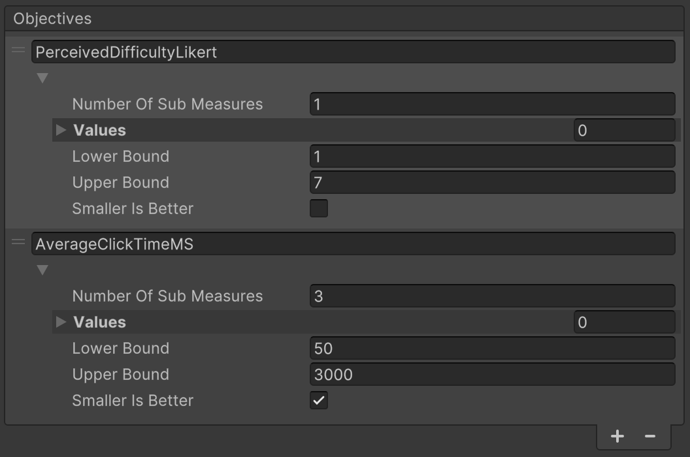

#### 8.2.3 Remove Objective

Select the objective by clicking the `=` icon in its top-left corner (turns blue). Click `-` at the bottom to remove it.

> **Note:** Reverse the steps you performed when adding the objective.

### 8.3 Get Parameter Values via Code

You can read the current parameter values each iteration by indexing into the *parameter* list on the *BOforUnityManager* instance.
Here is an example snippet:
```csharp
// the persistent manager that runs the study
BoForUnityManager bo = BoForUnityManager.Instance;

// by key (robust against reordering the inspector list);
// an unknown key logs a warning once and returns 0
float colorR = bo.optimizer.GetParameterValue("CubeColorR");

var i = 0;
// during an iteration, read the i-th parameter
float value = bo.parameters[i].value.Value;

// or loop through all parameters
for (int j = 0; j < bo.parameters.Count; j++) {
   var parameter = bo.parameters[j];
   Debug.Log($"Parameter {j} ({parameter.key}) = {parameter.value.Value}");
}
```
This gives you programmatic access to the parameter settings that the optimizer proposes.
The index follows the order of the parameter list visible in the Unity inspector view.

### 8.4 Set Objective Values via Code

By default, *QuestionnaireToolkit* updates objective values in each iteration.
If you want to override or set them manually, you can write into the *objective* list on the *BOforUnityManager* instance.
Example:
```csharp
BoForUnityManager bo = BoForUnityManager.Instance;

var i = 0;
// during an iteration, assign the i-th objective
// this assumes that there is only one sub-measure for this objective:
var myScore = 1.5f;
bo.objectives[i].value.values[0] = myScore;

// if you want to assign more than one sub-measure use the following...
// their average value will be sent to the optimizer as a single value for this objective
var myScoreA = 7.1f;
var myScoreB = 10f;
var myScoreC = 3.24f;
bo.objectives[i].value.values[0] = myScoreA;
bo.objectives[i].value.values[1] = myScoreB;
bo.objectives[i].value.values[2] = myScoreC;

// the following lines are necessary if you did not define the number of sub-measures in the inspector view
bo.objectives[i].value.numberOfSubMeasures = 3;
bo.objectives[i].value.values.Add(myScoreA);
bo.objectives[i].value.values.Add(myScoreB);
bo.objectives[i].value.values.Add(myScoreC);

// or multiple objectives
for (int j = 0; j < bo.objectives.Count; j++) {
   bo.objectives[j].value.values[0] = myScore + j;
   Debug.Log($"Objective {j} ({bo.objectives[j].value.values[0]}) = {myScore + j}");
}
```
The index follows the order of the objective list visible in the Unity inspector view.
Make sure you assign objective values before the optimizer proceeds so that the backend receives the feedback correctly.


### 8.5 Python Settings

**Default**:
If you leave `Manually Installed Python` unchecked, BOforUnity looks for Python 3.13 (the version the pinned packages are tested with) and prefers the bundled `3.13.7` runtime. Newer Python versions are only used if no 3.13 interpreter works. If no Python 3.13 or newer is found, it installs the bundled 3.13.7 first (Windows: UAC prompt; macOS: administrator prompt, from the bundled `.pkg`); on Linux, run `Linux/install_python.sh` or install `python3.13` and `python3.13-venv` with your package manager. If that installation is cancelled or fails, startup is aborted with the reason on screen.

The packages from `requirements.txt` are installed into a **private virtual environment** at `<persistentDataPath>/BOData/python-venv`, and the optimizer backends run with that environment's Python (another base interpreter gets its own sibling folder `python-venv-<hash>`; on Windows a short folder under `%LOCALAPPDATA%\BOforUnity\` is used when the path would be too long). The first Play installs them (a few minutes; the download is several hundred MB, progress is shown on screen); every later start only checks, in about a second, that the installed versions match the pins in `requirements.txt` and reinstalls on a mismatch. The Console logs the interpreter in use (`Optimizer Python: …`) — install optional packages such as openbo or `open_clip_torch` with that interpreter (`"<that path>" -m pip install …`). If no virtual environment can be created (Debian/Ubuntu without `python3.13-venv`), BOforUnity falls back to `pip install --user` and says so in the Console. On Linux, PyTorch is installed from its CPU wheel index (no multi-GB CUDA download). For offline labs, put the wheels into `Assets/StreamingAssets/BOData/Installation/wheels/`; pip uses them (create them with `python -m pip download -r requirements.txt -d wheels` on a machine with the same OS, architecture and Python version).

If the setup fails, the screen shows the reason, the Console shows the last lines of pip's output, and the complete output is in `<persistentDataPath>/BOData/pip-install.log`. The backend's own console output is in `<persistentDataPath>/BOData/BayesianOptimization/output.txt` (the previous session's in `output.prev.txt`; the installed package versions are listed at its top); at the end of a session it is also copied into the run's log folder.

You can **override** this behavior by checking `Manually Installed Python` and following the steps below:
 1. Open a terminal and search for Python installations:
    * Windows: `where python`
    * Linux/macOS: `which python3`
    Copy the path to a compatible Python (`3.13`, ideally the bundled `3.13.7` runtime), or to the Python of a virtual/conda environment (e.g. one created with `install_python.sh --venv DIR` / `installation_python.bat --venv DIR`).
 2. In *BOforUnityManager* → *Python Settings*, check the box
 3. Paste the path in the `Path of Python Executable` field (surrounding quotes are fine).

If that Python already is a virtual or conda environment, BOforUnity installs the packages into it directly; otherwise it creates its private environment from it, as above.

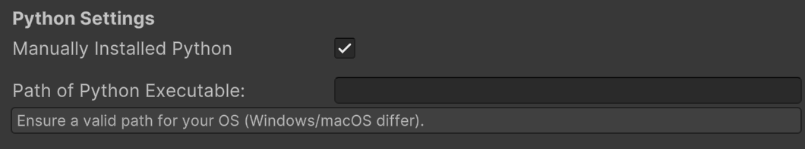


### 8.6 Study Settings

Set `User ID`, `Condition ID`, and `Group ID` in the inspector section shown in the [image](#py_st_ws_pr_settings).
If your study does not use any of these IDs, leave the field at -1. The value will still be logged, but you can ignore it in analysis.
These three values are always logged as context columns in `ObservationsPerEvaluation.csv` and are used together for final-design row filtering.

The same ID triad is also routed into QuestionnaireToolkit through Additional CSV Items. In the standard BO scenes, `QTQuestionnaireManager` reads these values from the active `BoForUnityManager`. In Fitts law baseline conditions where the BO manager is disabled, `FittsLawConditionManager` supplies the context instead.

Log folders are created below `Assets/StreamingAssets/BOData/LogData/` (in installed builds where StreamingAssets is read-only: `<persistentDataPath>/BOData/LogData/`). The user folder is a folder-safe version of `User ID`; invalid path characters are replaced. If that user folder already contains a folder for the current `Condition ID` (the same condition was run before with this ID), BOforUnity uses a suffix such as `_1` or `_2` to prevent overwriting prior data; the suffixed ID is then what Python, the questionnaires and every log row use. A user folder that only holds other conditions is reused. Condition folders are created inside the selected user folder.

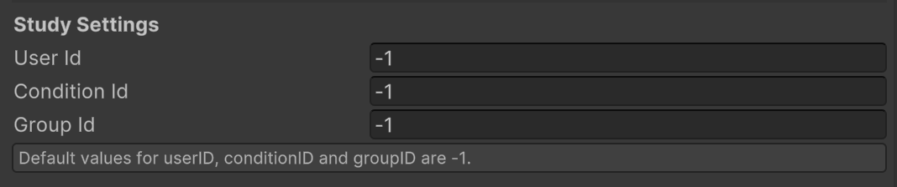

### 8.7 Optimizer Backend and CABOP Settings

`BoForUnityManager` now supports four backends:

* **BoTorch**: existing behavior (`bo.py` for single-objective, `mobo.py` for multi-objective). In `mobo.py`, BoTorch handles the GP model and acquisition function, while [moocore](https://github.com/multi-objective/moocore) computes Pareto flags and hypervolume metrics.
* **CABOP**: cost-aware optimization backend with selectable objective mode:
  * `SingleObjective` -> `cabop_bo.py` (requires exactly 1 objective).
  * `MultiObjectiveScalarized` -> `cabop_mobo.py` (requires at least 2 objectives; objectives are scalarized to one minimized score).
* **MetaTAF**: multi-objective Meta-BO backend (`meta_mobo.py`, requires at least 2 objectives). Transfers knowledge from *population models* built from prior participants' runs so new users converge in fewer iterations; if no valid population model is found, the run aborts by default (**Meta Require Sources**) rather than silently running plain multi-objective BO. See section 8.14 and the [student guide](docs/meta-taf-student-guide.md).
* **DBO**: dynamic BO backend (`dbo.py`, requires exactly 1 objective) for costs that **drift while the study runs** — participant adaptation, learning, fatigue. The GP covariance is multiplied by a temporal decay `alpha^|t-t'|` whose rate is fitted from the data, so the optimizer infers how fast the participant is changing instead of assuming they are not; a **DBO Stationary Baseline** toggle pins `alpha = 1` for the matched plain-BO control condition. See section 8.15 and [docs/dbo-backend.md](docs/dbo-backend.md).

CABOP addresses the practical case where design changes do not all have the same evaluation cost. For the broader cost-aware BO motivation and terminology, see Langerak, Zhang, Wang, Kristensson, and Oulasvirta's [Cost-Aware Bayesian Optimization for Prototyping Interactive Devices](https://dl.acm.org/doi/full/10.1145/3772318.3791024).
The optimizer in `BOData/BayesianOptimization/cabop/` is vendored from the authors' reference implementation ([aalto-ui/CABOP](https://github.com/aalto-ui/CABOP), MIT licence, copied to `cabop/LICENSE`); the local changes are listed in `cabop/__init__.py`.

CABOP inspector settings:

* **CABOP Use Cost Aware Acquisition**: enables EI-per-cost behavior.
* **CABOP Update Rule**: `Actual` (recommended), `Intended`, or `Both`.
* **CABOP Enable Cost Budget** + **CABOP Max Cumulative Cost**: optional stopping criterion in addition to iteration counts.
* **CABOP Group Costs**: group-level `unchanged/swapped/acquired` costs for both model cost (`cost`) and realized cost (`actual_cost`).
* **CABOP Tolerance** (per parameter): how close, as a fraction of the parameter's range, a proposal must be to an earlier design to reuse it. CABOP's cost model measures all distances this way, so a parameter's units (e.g. pixels vs. a 0–1 slider) do not change what counts as the same prototype. The backend prints each tolerance in parameter units at startup. Up to version 1.8.0 the tolerance was in parameter units: divide such a value by the range to convert it (e.g. 2 on `[18, 64]` → `0.0435`); values outside `[0, 1]` are refused.

API equivalents are available directly on `BoForUnityManager` fields:
* `optimizerBackend`
* `cabopObjectiveMode`
* `cabopUseCostAwareAcquisition`
* `cabopUpdateRule`
* `cabopEnableCostBudget`
* `cabopMaxCumulativeCost`
* `cabopGroupCosts`
* Parameter-level CABOP fields in `parameters[i].value`:
  * `cabopGroup`
  * `cabopTolerance`
  * `cabopPrefabricatedValues`
* Objective-level CABOP field in `objectives[i].value`:
  * `cabopWeight`

**What “prefabricated values / prefab snapping” means here**
This is **not** a Unity prefab asset reference. In CABOP, “prefab” means a predefined list of numeric parameter values that already exist (for example, already manufactured/fabricated settings). If a list is provided for a parameter, CABOP snaps proposals to the nearest listed value before sending parameters to Unity. The values must lie within the parameter's bounds; the backend refuses others at startup.

### 8.8 Questionnaire Prior Rating Hint (Optional)

In `BoForUnityManager` (Inspector), you can enable **Show Prior Rating Hint**.

Behavior:
- On slider questions (`QTSlider`) and Likert/linear scale questions (`QTLinearScale`), the questionnaire shows a subtle marker indicating the participant's previous rating for that same question.
- The question is still reset to unanswered for the new iteration. The hint is visual-only and does not submit an answer.
- If no previous rating exists yet, no hint is shown.

Bias control:
- Use **Hint Opacity** to keep the marker subtle (recommended range: low opacity).
- This helps users calibrate relative to their last response while minimizing anchoring pressure.

Technical note:
- The hint is keyed per questionnaire and question identity (slider/Likert) and persists across BO iterations during the same app run.


### 8.9 Problem Setup

Here, the current setup of design parameters (d) and design objectives (m) is shown as defined in the parameter and objectives list in the inspector. This serves as an overview to decide the optimization budget below.

Backend selection:
* `Optimizer Backend = BoTorch`
  * `m = 1` uses `bo.py`.
  * `m >= 2` uses `mobo.py`.
* `Optimizer Backend = CABOP`
  * `CABOP Objective Mode = SingleObjective` uses `cabop_bo.py`.
  * `CABOP Objective Mode = MultiObjectiveScalarized` uses `cabop_mobo.py`.
  * CABOP internally minimizes a scalar objective. For multi-objective mode, scalarization uses objective bounds, direction (`Smaller is Better`), and `CABOP Weight`.
* `Optimizer Backend = MetaTAF` uses `meta_mobo.py` (requires `m >= 2`).
* `Optimizer Backend = DBO` uses `dbo.py` (requires `m = 1`).


### 8.10 Optimization Budget

These options are in the lower part of this [image](#py_st_ws_pr_settings).

#### 8.10.1 Warm Start Settings

* Checking **Warm Start** skips the initial rounds. Optimization starts from prior results supplied as CSVs, formatted like the examples in *Assets/StreamingAssets/BOData/BayesianOptimization/InitData*.
* Copying a prior *ObservationsPerEvaluation.csv* into the new study’s log folder is optional and only needed if you want one continuous observation log across runs.
* Leaving it unchecked uses the default start. After the specified number of initial iterations (minimum 2), optimization begins using the collected values.
* **Warm Start Objective Format** controls how objective values in the warm-start objective CSV are interpreted:
  * `auto` (default): values within the objective's bounds are read as raw, otherwise values within `[-1, 1]` as `normalized_max`. Values up to half a unit of the third decimal outside the bounds still count as raw (logs written before 1.8.0 were rounded to 3 decimals). When both readings fit and differ, or when the normalized reading is used, the backend says so in `output.txt`; pick an explicit format if the guess is wrong. Parameter columns follow the same rule with `[0, 1]`, and on ranges wider than 1 also accept 0.05% of the range.
  * `raw`: values are in original objective bounds (`Lower/Upper Bound`), then converted internally.
  * `normalized_max`: values are already normalized to `[-1, 1]` in maximize-space.
  * `normalized_native`: values are normalized to `[-1, 1]` in native objective direction (entries with `Smaller is Better` are flipped internally).

> **Note:** CSV formats for warm start **must** match the examples. Headers must match the current number of parameters and objectives. Using logs from a prior study with the same settings satisfies this.

#### 8.10.2 Warm-Start CSV Checklist (Required)

* Both files must be in *Assets/StreamingAssets/BOData/BayesianOptimization/InitData* and referenced by file name in the inspector.
* Parameter CSV headers must exactly match parameter keys; objective CSV headers must exactly match objective keys.
* Parameter and objective CSVs must have the same number of rows and at least one row.
* All values must be numeric and finite (no `NaN`/`Inf`).
* For best compatibility, provide parameter values in original parameter bounds (`Lower/Upper Bound`).
* Objective values must follow the selected **Warm Start Objective Format**.

#### 8.10.3 Warm-Start CSV Examples

The examples below use `;` as delimiter and require headers that match your exact parameter/objective keys.

`raw` (original bounds):

```csv
ButtonSize;Contrast
0.35;0.70
0.55;0.40
```

```csv
Usability;TaskTime;ErrorCount
72;38;4
68;31;3
```

`normalized_max` (already in maximize-space `[-1,1]`):

```csv
ButtonSize;Contrast
0.35;0.70
0.55;0.40
```

```csv
Usability;TaskTime;ErrorCount
0.44;0.36;0.60
0.36;0.48;0.70
```

`normalized_native` (native direction `[-1,1]`, Python flips minimize objectives internally):

```csv
ButtonSize;Contrast
0.35;0.70
0.55;0.40
```

```csv
Usability;TaskTime;ErrorCount
0.44;-0.36;-0.60
0.36;-0.48;-0.70
```

#### 8.10.4 Objective Direction Semantics

* Internally, the optimizer always works in maximize-space.
* If **Smaller is Better** is enabled for an objective, the backend flips that objective internally.
* This flip is applied consistently in optimization, Pareto computation, and logging conversions.

#### 8.10.5 Objective Direction Example (2 Minimize, 1 Maximize)

Assume these three Unity objectives:

| Objective Key | Bounds | Smaller is Better | Example Raw Value | Internal Maximize-Space Value |
|---|---|---|---|---|
| `TaskTime` | `[0, 120]` | `true` | `30` | `+0.50` |
| `ErrorCount` | `[0, 20]` | `true` | `4` | `+0.60` |
| `Usability` | `[0, 100]` | `false` | `70` | `+0.40` |

How this is handled:
1. Values are normalized to `[-1,1]`.
2. Objectives with `Smaller is Better = true` are multiplied by `-1`.
3. Pareto checks (`is_non_dominated`) and hypervolume are computed on this consistent maximize-space representation.
4. `ObservationsPerEvaluation.csv` stores denormalized values in your original objective units.

`mobo.py` uses [moocore](https://github.com/multi-objective/moocore) for these Pareto and hypervolume calculations. BoTorch is still used for the surrogate model, acquisition function, and next-design proposal.

#### 8.10.6 Perfect Rating Settings

* Disabled by default.
* Enable **Perfect Rating** to terminate when a perfect rating is achieved.
* If **Perfect Rating In Initial Rounds** is checked (visible only when perfect rating is active), a perfect rating can also terminate during sampling.
* The check uses the value sent to Python: the mean of the objective's numeric sub-measures, so an unanswered optional item does not prevent a perfect rating.
* When a perfect rating ends the optimization early, Unity sends the backend a stop request: `output.txt` shows `Stop requested by Unity: perfect_rating`, the backend exits normally, and every rated design is in the logs (with final `IsBest`/`IsPareto` flags, also during sampling). If **Enable Final Design Round** is active, the final-design round follows exactly as after a full run.

#### 8.10.7 Iteration Progression Settings

* **Iteration Advance Mode** controls how the next evaluation iteration starts:
  * `NextButton`: legacy behavior (user presses the assigned Next button).
  * `ExternalSignal`: no built-in button dependency; trigger progression from your own logic.
  * `Automatic`: starts the next iteration automatically after a configurable delay.
* **Automatic Advance Delay (s)** is used only in `Automatic` mode. It counts real time, so it also elapses while a scene sets `Time.timeScale = 0`.
* **Reload Scene On Advance** controls whether the manager reloads the active scene when progressing.
  * Keep this enabled for the default sample-loop behavior.
  * Disable it if your app handles iteration transitions without scene reloads.
  * The scene is reloaded by its build index; a scene that is not in the Build Profiles scene list is reloaded by its asset path in the Editor. For player builds, add it to the scene list. An unsaved scene cannot be reloaded: the study stops before it starts and says so on screen.
  * Each reload instantiates the scene's own `BoForUnityManager` again; that copy is discarded and the first (persistent) manager keeps running. Use `BoForUnityManager.Instance` to reach it from your scripts.

For `ExternalSignal`, call this from your own UI/event logic:

```csharp
BoForUnityManager.Instance.RequestNextIteration();
```

If you use the bundled `QTQuestionnaireManager`, this request is queued automatically after questionnaire completion when `Iteration Advance Mode` is set to `ExternalSignal`.

#### 8.10.8 Final Design Round (Optional)

If **Enable Final Design Round** is active, the system adds one extra participant-facing round after BO completes.

What happens:
1. The Python backend finishes normal BO iterations and sends `optimization_finished` (the round also follows an early stop for a perfect rating).
2. Unity reads the latest `ObservationsPerEvaluation.csv` for the current context (`User ID`, `Condition ID`, `Group ID`).
3. Unity deterministically selects one final design and applies its parameter values. The Console names the candidate pool (`IsPareto`, `IsBest`, `computed` or `all`, see below).
4. The user runs one final round, but this round does **not** send objectives back to Python and does not continue optimization.
5. Unity appends this last evaluation to `ObservationsPerEvaluation.csv` with `Phase=finaldesign`, marker column `IsPareto`/`IsBest` set to `NULL`, `Iteration` one past the last iteration logged for this User/Condition/Group (never a live row's iteration, also under warm start; scripts can read it as `BoForUnityManager.FinalDesignLogIteration` once the final design is selected), `Context` set to the current context in contextual runs, and the same objective averaging and full precision as the rows Python writes. If the file is locked (e.g. open in Excel), Unity retries briefly, then writes the row to `ObservationsPerEvaluation_finaldesign_<timestamp>.csv` next to it and logs an error — append that row before analysis.

Selection logic (deterministic):
1. Normalize each objective via min-max over all CSV rows, after objective direction handling (`Smaller is Better` is internally flipped).
2. Primary criterion: smallest Euclidean distance to utopia (`[1,1,...,1]`) in normalized objective space.
3. Tie-break 1: largest maximin (maximize the worst normalized objective).
4. Tie-break 2: least-aggressive parameter profile (smallest L2 distance to the middle of the design space, each parameter normalized by its configured lower/upper bound).
5. Tie-break 3: earliest iteration index.

Candidate rows:
* MOBO: rows flagged by `IsPareto` are preferred.
* BO: rows flagged by `IsBest` are preferred.
* If the log has these columns but none of the participant's rows is flagged (e.g. a non-contextual warm start where a warm-start row is the best observation), the best (one objective) or non-dominated (several objectives) rows are computed from the participant's own rows, using each objective's direction and bounds like the backends (`computed`, with a Console warning).
* Logs without these columns: all rows are considered.

Inspector controls:
* **Enable Final Design Round**: activates the feature.
* **Utopia Distance Epsilon**, **Maximin Epsilon**, **Aggression Epsilon**: tolerances for deterministic tie handling.

Integration note:
* If you use `QTQuestionnaireManager`, finishing the final round still triggers its normal completion flow.
* `BoForUnityManager` detects that this is the final non-BO round and ends the loop without sending objectives to Python.

<a id="py_st_ws_pr_settings"></a>

| **Name**       | **Default Value** | **Description**                                                                                   |
|-----------------|-------------------|---------------------------------------------------------------------------------------------------|
| **Sampling Iterations**   | [2(d+1)](https://botorch.org/docs/tutorials/constrained_multi_objective_bo/)   | Number of sampling iterations before optimization; the recommended value is `2 * (Number of Design Parameters + 1)`. You can overwrite this default by checking `Set Sampling Iterations Manually`.              |
| **Optimization Iterations**|                 | Number of iterations used to refine results; here, the actual optimization takes place.                       |
| **Total Iterations** |            | Sum of `Sampling Iterations` and `Optimization Iterations`. This is how long the HITL process will run in total.                                                           |

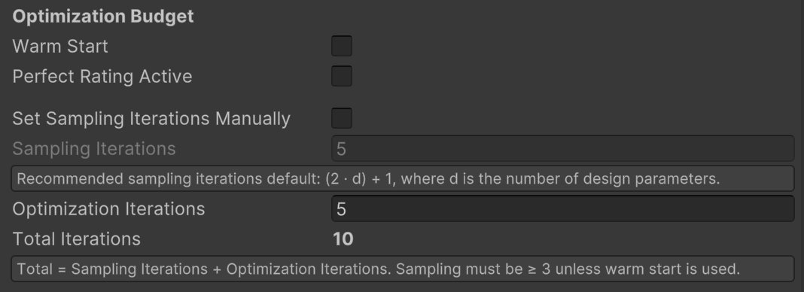


### 8.11 Model and Algorithm Hyperparameters

The hyperparameters affect how efficiently the optimizer searches the space. The adjustable hyperparameters are shown in this [image](#BO_hyper_settings).

| **Name**       | **Default Value** | **Description**                                                                                   | **More Information**                                                                                                   |
|-----------------|-------------------|---------------------------------------------------------------------------------------------------|------------------------------------------------------------------------------------------------------------------------|
| **Batch Size**  | 1                 | Number of evaluations performed in parallel. **Current HITL implementation supports only `1`; larger values are forced to `1` at runtime.** | [Batch Size Explanation](https://mljourney.com/how-does-batch-size-affect-training/)                                   |
| **Num Restarts**| 10                | Optimization restarts to escape local optima (inspector label: **Optimizer Restarts**).           |                                                                                                                        |
| **Raw Samples** | 1024              | Random samples to initialize acquisition optimization. Must be at least **Num Restarts** (checked at startup). |                                                                                                                        |
| **MC Samples**  | 128               | Monte Carlo samples to approximate the acquisition function. 128 (512 up to version 1.8.0) makes multi-objective suggestions several times faster at practically the same candidates. Keep the value fixed within a study. | [MC Samples Explanation](https://www.sciencedirect.com/topics/mathematics/monte-carlo-simulation)                      |
| **Seed**        | 3                 | Random seed for reproducibility. The MetaTAF backend requires `Seed >= 0`.                        | [Seed Explanation](https://en.wikipedia.org/wiki/Random_seed)                                                          |


> **Note:** Recommended default: `Sampling Iterations = 2(d + 1)`, where `d` is the number of design parameters. Warm start sets sampling iterations to `0`.

> **Note:** The DBO backend uses analytic (log) Expected Improvement, so **MC Samples** has no effect there; `Num Restarts`, `Raw Samples`, and `Seed` apply as usual.

> **Note:** The single-objective backends (BoTorch `bo.py`, DBO) run PyTorch on one thread, which measured 1.4–1.6× faster per suggestion than all cores with identical suggestions at study sizes, and leaves the other cores to Unity. Set the environment variable `BO_TORCH_THREADS` to override. The multi-objective backends keep PyTorch's default, since their hypervolume computations do benefit from several threads.
<a id="BO_hyper_settings"></a>

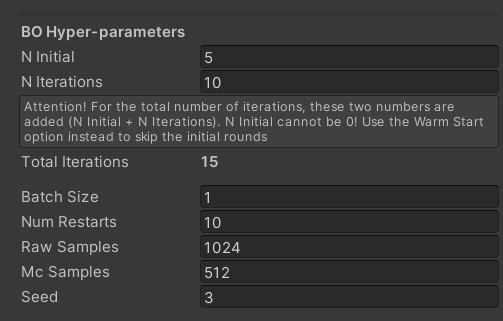


### 8.12 Output Files and Metrics

All runtime logs are grouped by participant/run and condition under `Assets/StreamingAssets/BOData/LogData/`. In installed builds where StreamingAssets is read-only, all of them (optimizer, questionnaire, Fitts telemetry, final-design row) go to `<persistentDataPath>/BOData/LogData/` instead, with the same layout.

The general layout is:

```text
LogData/
  <USER_LOG_ID>/
    <CONDITION_LOG_ID>/
      Questionnaire-*.csv
      <optional app-specific logs>
      run/
        ObservationsPerEvaluation.csv
        ExecutionTimes.csv
        HypervolumePerEvaluation.csv or BestObjectivePerEvaluation.csv
        DboDiagnosticsPerEvaluation.csv   (DBO backend only)
        DboRunState.json                  (DBO backend only)
        MetaRunState.json                 (MetaTAF backend only)
        MetaWeightsPerEvaluation.csv      (MetaTAF backend only)
        MetaSourcesUsed/                  (MetaTAF backend only)
        output.txt                        (backend console log of the session, copied at the end)
      CABOP/
        single/run/
        multi/run/
```

`<USER_LOG_ID>` and `<CONDITION_LOG_ID>` are folder-safe versions of `User ID` and `Condition ID`. If `<USER_LOG_ID>/<CONDITION_LOG_ID>` already exists, BOforUnity creates a suffixed user folder such as `<USER_LOG_ID>_1` to avoid overwriting. Within that user folder, all condition-specific files are written below their condition folder.

BO/backend run files are written to:
* *Assets/StreamingAssets/BOData/LogData/&lt;USER_LOG_ID&gt;/&lt;CONDITION_LOG_ID&gt;/run/*
* *Assets/StreamingAssets/BOData/LogData/&lt;USER_LOG_ID&gt;/&lt;CONDITION_LOG_ID&gt;/CABOP/single/run/* (CABOP single-objective runs)
* *Assets/StreamingAssets/BOData/LogData/&lt;USER_LOG_ID&gt;/&lt;CONDITION_LOG_ID&gt;/CABOP/multi/run/* (CABOP multi-objective-scalarized runs)
* Legacy runs may exist under *&lt;Unity persistentDataPath&gt;/BOData/LogData/&lt;USER_LOG_ID&gt;/* or *Assets/StreamingAssets/BOData/BayesianOptimization/LogData/&lt;USER_LOG_ID&gt;/*; final-design selection checks those locations too.

The backend's console output is written live to `<persistentDataPath>/BOData/BayesianOptimization/output.txt` (previous session: `output.prev.txt`) and copied into the session's `run/` folder when the session ends (into the condition folder as `output_<timestamp>.txt` when the backend never created a run folder).

Common files:
* `ObservationsPerEvaluation.csv`: denormalized parameter/objective observations per evaluation.
* `ExecutionTimes.csv`: optimization-step runtimes.
* QuestionnaireToolkit raw result CSVs default to *Assets/StreamingAssets/BOData/LogData/&lt;USER_LOG_ID&gt;/&lt;CONDITION_LOG_ID&gt;/* and include `UserID`, `ConditionID`, and `GroupID`.
* The Fitts law scene additionally writes `FittsLawAppLog.csv` and `FittsLawTrialLog.csv` (incl. ISO 9241-9 throughput metrics, see [6.2.5](#625-logging)) to the same condition folder. Its questionnaire CSV also includes measured `speed` and `accuracy` columns.
* Questionnaire `started`/`finished` timestamps are ISO 8601 UTC (`yyyy-MM-ddTHH:mm:ss.fffZ`); Additional CSV Item values are written culture-invariantly (`0.5`, never `0,5`).

All backends:
* The `Iteration` of every row in the metric files (`BestObjectivePerEvaluation.csv`, `HypervolumePerEvaluation.csv`) is the `Iteration` of the same evaluation in `ObservationsPerEvaluation.csv`, so the files join on it. Warm-start runs add one baseline row at the iteration of the last current-context warm-start row (`0` if none).
* Parameter and objective values are logged with 10 significant digits, which keeps every bit of the float32 values Unity exchanges.

MOBO (`mobo.py`, `m >= 2`):
* `ObservationsPerEvaluation.csv` uses `IsPareto`.
* `HypervolumePerEvaluation.csv` stores hypervolume after every sampling and optimization evaluation. Its `Scale` column records that objectives are normalized to maximize-space `[-1,1]`, and `ReferencePoint` records the reference point, −1.1 in every objective (slightly below the worst value, so a Pareto-optimal design rated worst on one objective still adds hypervolume). qLogNEHVI uses the same reference point. Hypervolumes logged by versions up to 1.8.0 (reference point −1) are smaller and not comparable.
* Unity `coverage` corresponds to current hypervolume.

MetaTAF (`meta_mobo.py`, `m >= 2`):
* Writes the MOBO files (`IsPareto`, `HypervolumePerEvaluation.csv` with the same reference point), plus:
* `MetaWeightsPerEvaluation.csv`: one row per optimization iteration, `Iteration;OptimizationStep;TargetWeight;DecayFactor;<one column per population model>`. `Iteration` is the global evaluation index, as in the other logs (files written up to version 1.8.0 logged the optimization step as `Iteration` and have no `OptimizationStep` column).
* `MetaRunState.json`: the run's provenance (library versions, openbo install and module hashes, optimizer configuration, frame, sources, population manifest), rewritten after every evaluation with its progress; `finished`/`finish_reason` say how the run ended (`completed`, `stop_requested`, `error`, `startup_abort`).
* `MetaSourcesUsed/`: copies of the population models the optimizer loaded.

Single-objective BO (`bo.py`, `m = 1`):
* `ObservationsPerEvaluation.csv` uses `IsBest`.
* `BestObjectivePerEvaluation.csv` stores the best-so-far objective per evaluation: `BestObjective` in normalized maximize-space `[-1,1]` (the value `coverage` reports; sign-flipped for **Smaller is Better** objectives), `Iteration`, `Scale` (the frame and the objective's direction) and `BestObjectiveRaw`, the same best observation in the objective's own units (empty for a contextual warm-start baseline without current-context observations).
* `HypervolumePerEvaluation.csv` is also written for backward compatibility (mirrors the best-objective trace, with the same `Scale` and `BestObjectiveRaw` columns).
* Unity `coverage` corresponds to current best normalized objective.

CABOP (`cabop_bo.py` / `cabop_mobo.py`):
* Logs are separated under each user's condition folder in `CABOP/single` and `CABOP/multi`.
* `ObservationsPerEvaluation.csv` is reused: `IsBest` (single mode) marks the best row; `IsPareto` (multi mode) marks the non-dominated rows of the raw objective values in each objective's direction (the CABOP weights only steer the optimizer), the first copy of duplicates only, as in MOBO. These are the final-design candidates.
* `ExecutionTimes.csv` is reused; `Optimization` is the evaluation's `Iteration` and includes the sampling rounds.
* `CABOPMetricsPerEvaluation.csv` stores scalarized objective trace and realized/cumulative cost.
* Compatibility metric file:
  * single mode: `BestObjectivePerEvaluation.csv`
  * multi mode: `HypervolumePerEvaluation.csv` (stores CABOP coverage trace for compatibility)
  * With warm start it starts with a baseline row at the Iteration of the last warm-start row, as for BoTorch; `CABOPMetricsPerEvaluation.csv` keeps one row per evaluation of the run.
* Unity `coverage` is `1 - best_scalarized_objective` (higher is better).

DBO (`dbo.py`, `m = 1`):
* Writes the same files as single-objective BO (`IsBest`, `BestObjectivePerEvaluation.csv` with `Scale` and `BestObjectiveRaw`, legacy `HypervolumePerEvaluation.csv` mirror), to the same `run/` folder, so existing analysis scripts keep working; `coverage` keeps its best-so-far meaning.
* Additionally writes `DboDiagnosticsPerEvaluation.csv` (`Iteration;Phase;IsValidation;Alpha;PredictedCost;PredictedSd;ObservedCost;ObservedObjective;SuggestSeconds`). `Alpha` is the fitted temporal decay per iteration — near `1.0` throughout means the objective did not measurably drift; `PredictedCost` vs `ObservedCost` on validation rows measures model accuracy independently of exploration luck. See [8.15](#815-dynamic-bo-dbo-optimizing-a-drifting-objective).
* Also writes `DboRunState.json`, the optimizer's own record (dbo_torch/torch/botorch versions, full configuration, RNG state, every observation with its prediction), rewritten after every evaluation; `DynamicBO.load()` restores it exactly for offline analysis.

During sampling, Unity `tempCoverage` is a progress value in `[0,1]`.

Iteration numbering note:
* Without warm start, `Iteration` in `ObservationsPerEvaluation.csv` counts this run's evaluations (sampling + optimization).
* With warm start (non-contextual), `Iteration` continues from the number of loaded warm-start rows, i.e. the first new evaluation of a run warm-started with `n` rows is logged as `Iteration = n + 1`. This is intentional: the loaded rows are treated as earlier evaluations of the same optimization problem.
* With contextual optimization, `Iteration` counts **current-context** evaluations only; warm-start rows from other contexts never advance it (see [8.13](#813-contextual-optimization-and-context-embeddings-lce-m-gp)).
* Every `parameters` message Python sends to Unity carries this value as `iteration`, so Unity knows the `Iteration` under which the design it is about to show will be logged (`BoForUnityManager.LastSuggestionLogIteration`). All five backends number evaluations this way, CABOP included.

**Logs open in other programs.** You can open the logs while a study runs. The backends rewrite `ObservationsPerEvaluation.csv` after every evaluation through a temporary file, so a crash never leaves a half-written log. If a log is locked by another program (Excel on Windows), the backend retries for 2 seconds, prints `Warning: could not write <file> ...` once and continues the study. The rows are kept in memory, and the log's complete content is also kept next to it as `<name>.unsaved.csv` (e.g. `ObservationsPerEvaluation.unsaved.csv`). As soon as the file is free again, the backend writes it and deletes that copy. A copy that still exists after the session holds the complete log: close the program and replace the original with it before analysis.


### 8.13 Contextual Optimization and Context Embeddings (LCE-M GP)

Contextual optimization models observations from multiple **contexts** — for example different users, devices, rooms, or simulator configurations — in a single multi-task GP. It uses BoTorch's LCE-M model (`LCEMGP`, the latent context embedding multioutput kernel from Feng et al.'s [High-Dimensional Contextual Policy Search with Unknown Context Rewards using Bayesian Optimization](https://proceedings.neurips.cc/paper/2020/hash/faff959d885ec1ecf843a3f45087e047-Abstract.html), NeurIPS 2020). The typical HITL use case: you already collected data with participants A and B (other contexts) and now optimize for participant C — the model transfers what it learned from similar contexts, so fewer iterations are needed for the current one.

Supported for the **BoTorch backend only** (`bo.py` and `mobo.py`); CABOP does not support contexts.

#### 8.13.1 Enabling and Configuring Contexts

In the `BoForUnityManager` inspector, section **Contextual Optimization (LCE-M GP)**:

* **Enable Contextual Optimization**: turns the feature on.
* **Context Embedding Source**: how the per-context embedding is defined:
  * `Learned` (default): a low-dimensional embedding per context is learned from the observation data. No extra input required. Works best when several observations exist per context.
  * `Manual`: each context provides its own embedding vector in the inspector (or via code). Use this to inject *any* context representation you can compute — questionnaire profiles, sensor statistics, or image/text features from an external encoder.
  * `Image`: each context provides an image (e.g., a screenshot of the scene, the device, or the environment). The Python backend embeds it with an [open_clip](https://github.com/mlfoundations/open_clip) vision transformer.
* **Current Context Key**: the context this session's new observations belong to. Must match one of the configured context keys.
* **Contexts**: one entry per context (`key`, optional `embedding`, optional `imagePath`). Keys must be unique; the list order defines the internal context indices.
* **Normalize Embeddings** (Manual/Image, field `normalizeContextEmbeddings`, on by default; called "L2-Normalize Embeddings" up to version 1.8.0): brings the provided embeddings into the range the task kernel handles well.
  * `Manual`: each feature is standardized across the configured contexts (mean 0, variance 1, then scaled so the contexts' mean squared distance from their centroid is 1). Magnitudes stay meaningful: ages 25, 40 and 60 remain three different contexts. A feature with the same value in every context carries no information and is ignored. Turn it off only if your vectors are already on a unit scale; raw features such as ages make every pair of contexts look unrelated.
  * `Image`: each embedding is L2-normalized (the CLIP convention: the direction carries the meaning, the norm does not).
  * The backend warns when two contexts end up with identical embeddings: the model then treats them as one context until their observations show otherwise.
  * With only **two** contexts, per-feature standardization places them at a fixed distance whatever their raw values (ages 30/31 and 30/60 look equally different). If you have two contexts and the absolute difference matters, scale the features yourself and turn normalization off. Image/text features from an external encoder passed as `Manual`: with 4 or more contexts standardization works as well as L2; with 2–3 contexts, L2-normalize them yourself and turn normalization off.

Code API equivalents on `BoForUnityManager`: `contextualOptimization`, `contextEmbeddingSource`, `currentContextKey`, `contexts`, `normalizeContextEmbeddings`, `contextEmbeddingModel`, `contextEmbeddingPretrained`.

#### 8.13.2 Image Embeddings with ViT-G/14 (or Smaller Models)

With `Context Embedding Source = Image`:

* **Image Embedding Model** defaults to `ViT-bigG-14` — open_clip's release of **ViT-G/14** (~1.8B-parameter vision transformer, 1280-dimensional image embeddings). **Pretrained Weights Tag** defaults to the matching `laion2b_s39b_b160k`.
* ViT-G/14 downloads roughly 10 GB of weights on first use and needs a correspondingly capable machine. For quick experiments, `ViT-B-32` with tag `laion2b_s34b_b79k` is a light-weight alternative (embeddings from different models are not interchangeable — keep the model fixed within a study).
* The optional Python dependencies must be installed into the interpreter used by the optimizer, which the Console logs at startup as `Optimizer Python: …` (by default BOforUnity's private environment, see [8.5](#85-python-settings)): `"<that path>" -m pip install open_clip_torch pillow`. They are intentionally not part of `requirements.txt` so the default installation stays slim; a clear error with install instructions is raised if they are missing.
* Relative image paths are resolved against `Assets/StreamingAssets/BOData/InitData/`.
* Embeddings are cached under `InitData/ContextEmbeddingCache/` keyed by image content and model, so the vision model only runs when an image or the model configuration changes (override the cache location with the `BO_EMBED_CACHE` environment variable).

Because ViT-G/14 (like all CLIP-style encoders) maps semantically similar images to nearby vectors, visually similar contexts share more information in the task kernel — exactly what the LCE-M model exploits.

#### 8.13.3 Warm Start Across Contexts

To transfer data from other contexts, enable **Warm Start** and add a `Context` column to the initial **parameters** CSV, assigning each row to a context key (see `ExampleContextInitDataParameters.csv` / `ExampleContextInitDataObjectives.csv` in `InitData/`):

```text
Context;ButtonSize;AnimationSpeed
user_A;0.2;0.8
user_B;0.4;0.5
```

* Rows may reference any configured context key (matched case-insensitively); unknown keys fail fast with a clear error.
* If the `Context` column is missing, all warm-start rows are assigned to the current context (with a console warning).
* New observations are always assigned to the **Current Context Key**.

#### 8.13.4 Behavior and Outputs

* The GP is trained on all contexts jointly; the acquisition function only proposes designs for the current context.
* A context without any observations yet (e.g. a new participant whose warm start holds only other participants) is supported; its mean level is the average of the observed contexts'. With `Manual` or `Image` embeddings the task kernel uses the provided embeddings, so the new context's similarity to the others is defined by its embedding (a new participant with the same embedding as an observed one is predicted like that participant until its own data differ). With `Learned` embeddings its embedding stays untrained (random) until it has data, so for transfer to a new participant use `Manual` or `Image` embeddings.
* Run metrics (`coverage`, `IsBest`/`IsPareto`, hypervolume/best-objective traces) are computed over **current-context observations only** — warm-start rows from other contexts inform the model but do not appear in this run's metrics.
* `ObservationsPerEvaluation.csv` gains a `Context` column (after `Phase`) recording the context of every logged observation.
* Manual embeddings travel in the init message (about 16 KB per context at 1280 dimensions, 51 KB at 4096). The backends accept messages up to 64 MiB, and Unity refuses to send a larger init; the environment variable `BO_MAX_RECV_BUF_BYTES` changes the limit (Unity reads it from its own process environment, Python from the backend's).

### 8.14 Meta-BO (MetaTAF): Transfer from Prior Participants

The **MetaTAF** backend implements multi-objective Meta-Bayesian optimization: it blends the
current user's own model (BoTorch `qLogNEHVI`) with hypervolume-improvement terms from
**population models** — GP surrogates built from *prior participants' completed runs* — so a
new user starts from what the population already revealed instead of from scratch. The
mechanism follows the Transfer Acquisition Function line of work (Wistuba et al., 2018;
Liao et al., CHI 2024) lifted to Pareto/hypervolume optimization, implemented in the
[openbo](https://github.com/M-Colley/openbo) package (MIT, fork of
[yichiliao/openbo](https://github.com/yichiliao/openbo) with correctness fixes and the
multi-objective optimizers).

Quick facts:

* Requires **at least 2 objectives**; single-objective studies use the BoTorch backend.
* Requires the **openbo** Python package (one extra `pip install` with the interpreter the Console logs as `Optimizer Python: …`; see the guide).
* Population models are generated **offline** with `meta_train.py` from prior runs'
  `ObservationsPerEvaluation.csv` and placed under `StreamingAssets/BOData/MetaSources/`.
  The tool requires explicit provenance stamps (`--source-type`, `--y-calibration`), so
  artifacts can never silently claim human-measured data they do not contain. Each source is
  named after its run's path (e.g. `p01_main_run`), sources already in the folder are kept
  (rebuilt only with `--force`), and `--dry-run` shows what would be written.
* Sources whose parameter/objective definitions (names, bounds, minimize flags) do not
  exactly match the live study are **skipped with an explanation** — this protects you from
  silently transferring a mismatched or inverted response surface.
* With **zero** sources actually loaded by the optimizer the run **aborts by default**
  (`Meta Require Sources` inspector toggle), before the first trial, and lists why each
  candidate was rejected — frame mismatches as well as artifacts that match the frame but
  cannot be used (e.g. an unreadable trajectory). A MetaTAF study condition must not
  silently degrade into the no-transfer control. Disable the toggle only for an
  intentionally source-less (plain multi-objective BO) run.
* For the same Seed, MetaTAF starts from the same initial Sobol design as the BoTorch
  backends, so a MetaTAF-vs-BoTorch comparison is not confounded by different starting
  points.
* Not compatible with Warm Start (population models replace it) or Contextual Optimization
  (LCE-M stays BoTorch-only).
* Each run writes an extra `MetaWeightsPerEvaluation.csv` logging how strongly each
  population model influenced every iteration (plus the decay factor; `Iteration` is the
  global evaluation index, so it joins with the other logs), a `MetaSourcesUsed/` folder
  archiving exactly the sources the optimizer loaded, and `MetaRunState.json` with the run's
  provenance (library versions, how openbo is installed plus hashes of its modules, the exact
  optimizer configuration, the frame, and the loaded/dropped/rejected sources), rewritten
  after every evaluation with the run's progress and, at the end, why it finished — check
  them when analyzing or debugging a study.
* Use a non-negative **Seed** (the same in every condition): MetaTAF refuses negative seeds.

**Full walkthrough for students: [docs/meta-taf-student-guide.md](docs/meta-taf-student-guide.md).**

Study-design note: if Meta-BO is a *condition* in your experiment, freeze the population
model set **before** the main study and give every participant the identical set —
accumulating sources across your analyzed participants makes later participants depend on
earlier ones (an ordering confound). `meta_train.py` writes a `population.json` manifest into
the source folder; while it is present, a run whose loaded population differs from it does
not start. Details and citations in the guide.

### 8.15 Dynamic BO (DBO): Optimizing a Drifting Objective

Standard BO assumes the same design yields the same response all session. Human-in-the-loop
studies break that assumption routinely: participants adapt, learn, fatigue, and habituate,
so the optimum **moves while the optimizer is searching for it**. A stationary GP explains
the resulting mismatch as noise, widens its error bars, and keeps recommending a design
that stopped being optimal.

The DBO backend (`dbo.py`, single-objective) multiplies the GP covariance by a temporal
decay `alpha^|t-t'|` and fits `alpha in (0, 1]` from the data by marginal likelihood, so
the model *infers how fast the participant is changing* rather than being told. At
`alpha = 1` it reduces exactly to stationary BO — which is why the baseline is a toggle,
not a separate implementation.

Inspector settings (visible when `Backend = DBO`):

* **DBO Spatial Kernel** (`Rbf` default): covariance over design parameters; Rbf matches the reference DBO implementation.
* **DBO Alpha Parameterization** (`Decay` default): `Decay` reproduces the reference implementation; `Direct` behaves better when drift is fast.
* **DBO Initial Alpha** (`0.99`): starting decay rate before fitting, strictly below `1` (alpha can never be fitted away from exactly `1`; use **Stationary Baseline** to pin it).
* **DBO Exploration Ratio** (`0.1`): re-search with inflated variance when the acquisition collapses onto a design the model is already sure about; `0` disables.
* **DBO Acquisition Time Offset** (`0`): `0` scores candidates at the current time (reference behavior); `1` scores them at the time they will actually be evaluated.
* **DBO Validation Every** (`0` = off): every N iterations apply the model's **best estimate** instead of an exploratory point. Validation iterations make optimizers comparable across conditions — without them, differences in exploration policy confound the comparison.
* **DBO Validation Confidence** (`0.01`) and **DBO Validation Visited Only** (on): how the best estimate is selected (upper-confidence bound; restricted to already-tried designs, the reference behavior).
* **DBO Stationary Baseline** (off): pin `alpha = 1` — plain BO with everything else identical, the ablation/control condition.

Notes and constraints:

* Requires exactly **1 objective**; not compatible with Contextual Optimization (LCE-M stays BoTorch-only).
* Sampling uses the same Sobol draw as the BoTorch backend for matching config, so a DBO condition and a BoTorch/stationary-baseline condition visit **identical sampling points** and diverge only once the model takes over.
* Warm start works, with a modelling caveat: imported rows carry no timestamps, so they are replayed as the immediately preceding iterations — the decay kernel treats last week's session as if it ended moments ago. If the participant plausibly changed between sessions, that is an implicit assumption; stationary BO has no equivalent exposure.
* Runs are reproducible from the inspector **Seed**: the optimizer owns its random-number generator. Results for the same seed differ between dbo_torch versions, so do not mix versions within one study; each run records its version in `DboRunState.json`.
* After every run, check `Alpha` in `DboDiagnosticsPerEvaluation.csv` (also printed live to the Unity console): **near `1.0` throughout means the objective did not measurably drift and the BoTorch backend would have done the same job.**

The implementation is the BSD-3-Clause [dbo-torch](https://github.com/M-Colley/dbo-torch)
package (validated against the reference MATLAB implementation to ~1e-14), vendored under
`BOData/BayesianOptimization/dbo_torch/`. Method: Kim & Sergi,
[Comput. Methods Biomech. Biomed. Eng. 2025](https://doi.org/10.1080/10255842.2025.2595150)
and [IEEE RA-L 2026](https://doi.org/10.1109/LRA.2026.3665072). Backend details, protocol
check, and vendor-update instructions: [docs/dbo-backend.md](docs/dbo-backend.md).

<br>

## 9. Troubleshooting

| Symptom | Likely Cause | Fix |
|---|---|---|
| "Python setup failed: …" in Unity | No usable Python, or pip could not install `requirements.txt` | The message names the cause; the Console shows the last lines of pip's output and `<persistentDataPath>/BOData/pip-install.log` has all of it. Re-check [Python Settings](#85-python-settings) and press Play again. |
| "The optimizer backend could not be started: …" / "The optimizer backend stopped: …" (or "The system could not be started...") | The backend exited; the text is its last error line | Fix the reported cause (e.g. the port row below). The full backend output is in `<persistentDataPath>/BOData/BayesianOptimization/output.txt` (previous session: `output.prev.txt`). |
| "Invalid optimizer configuration." on screen at startup | A setting the backend would crash on later: empty, duplicate or reserved keys, a parameter Lower Bound not below its Upper Bound, Raw Samples < Optimizer Restarts, a negative Seed with MetaTAF, a CABOP tolerance outside `[0, 1]` or prefabricated values outside the bounds | The message lists each problem; the inspector shows the same errors in red under the objective list. (The backends refuse the same settings, e.g. `rawSamples (...) must be >= numRestarts (...)` or `Parameter '<key>' has a degenerate range`.) |
| "Optimizer connection failed." on screen during a study | Python ended unexpectedly or sent an invalid message | See `output.txt` / the Console for the Python traceback. The study stops on purpose so no design is shown without the optimizer. |
| `externally-managed-environment` (PEP 668) in the pip log | BOforUnity could not create its private environment (Debian/Ubuntu without the venv module) and fell back to `pip install --user`, which system Pythons refuse | `sudo apt install python3.13-venv` (or run `Linux/install_python.sh`), then press Play again. |
| "Waiting for another Unity instance … to finish installing the Python dependencies" | A second Unity instance of the same project (e.g. a ParrelSync clone) is installing into the shared environment | Wait; the setup continues when the other install finishes. |
| "this Python runs as 'x86_64', but the pinned PyTorch ships … arm64 … only" | An Intel-only Python on Apple Silicon (e.g. Homebrew under `/usr/local`) | Use the bundled python.org 3.13 (universal2) or an arm64 Python. An Intel (Rosetta) Unity is fine: Python is started as arm64 automatically. |
| openbo or open_clip "not installed" although you installed it | The backends run in BOforUnity's private environment, not your system Python | Install it with the interpreter logged as `Optimizer Python: …` at startup (`"<that path>" -m pip install …`); the error message prints the same command. |
| Loop stalls after questionnaire `Finish` | Objective values were not assigned, or objective keys do not match questionnaire headers | Verify each objective key is mapped and receives a value each iteration. |
| Loop does not progress in `ExternalSignal` mode | `RequestNextIteration()` is not called from your custom flow | Add the explicit call after your evaluation step ends. |
| Loop does not progress in `NextButton` mode | `Next Button` not assigned or not wired to `ButtonNextIteration()` | Assign the button reference and Unity `OnClick` event to `BoForUnityManager.ButtonNextIteration()`. |
| Warm start fails on startup | Missing CSV files, wrong headers, non-numeric values, or wrong format setting | Validate files against [Warm-Start CSV Checklist (Required)](#8102-warm-start-csv-checklist-required) and [Warm-Start CSV Examples](#8103-warm-start-csv-examples). |
| `ObservationsPerEvaluation.csv columns mismatch` error | Existing log file schema no longer matches current parameters/objectives | Back up and remove `Assets/StreamingAssets/BOData/LogData/<USER_LOG_ID>/<CONDITION_LOG_ID>/`, then rerun to regenerate headers. |
| No parameter changes between iterations | Simulation does not apply incoming parameter values from `bo.parameters` | Confirm your scene reads and applies updated parameter values each iteration. |
| `coverage`/Pareto behavior seems inconsistent with minimize objectives | Misunderstanding of internal maximize-space conversion | See [Objective Direction Semantics](#8104-objective-direction-semantics) and [Objective Direction Example (2 Minimize, 1 Maximize)](#8105-objective-direction-example-2-minimize-1-maximize). |
| Fitts law questionnaire says required items are missing | Aesthetics/usability slider items are not present or their `Header Name` values do not match the objective keys/submeasure names | Create the items manually in the scene. Use `aesthetics` and either `usability` or submeasure headers such as `usability1` and `usability2`. |
| Fitts law target buttons overlap | `button_distance` is too small for the current `button_size`/`targetCount`, or values were edited outside the recommended ranges | Use the default constrained bounds or increase `button_distance`. The runtime shrinks an unsafe layout (logged as `AppliedLayoutAdjusted = TRUE` with a warning), but the inspector bounds should still be kept feasible. |
| Errors every frame about `UnityEngine.Input` ("You are trying to read Input using the UnityEngine.Input class, but you have switched active Input handling to Input System package") | The project uses only the Input System, and an EventSystem in the scene still has a `StandaloneInputModule` | EventSystems the toolkit creates now get `InputSystemUIInputModule`. Replace a `StandaloneInputModule` saved in your scene (select the EventSystem; Unity offers a "Replace with InputSystemUIInputModule" button), or set Active Input Handling to `Both`. |
| Logs appear under a suffixed user folder such as `_1` | The requested `User ID` already had a folder for this `Condition ID` (the condition was run before with the same ID) | This is expected overwrite protection. Use the suffixed folder as the current run's user folder, or give the participant a new ID. |
| `Warning: could not write ...ObservationsPerEvaluation.csv` in `output.txt` | The log is open in a program that locks it (Excel on Windows) | Nothing is lost and the study continues. Close the file: the backend saves it at the next evaluation and deletes `<name>.unsaved.csv`. If that copy is still there after the session, it is the complete log; use it in place of the original. |
| Error `… The row was written to '…_finaldesign_<timestamp>.csv' instead` | `ObservationsPerEvaluation.csv` was open in another program when the final-design row was appended | Close log files during sessions; append the row from the fallback file before analysis. |
| `Received a malformed JSON line from Unity while waiting for objectives` | Unity sent an objectives reply that is not valid JSON | Check the payload preview in the error. The backend stops at once instead of waiting an hour for objectives that cannot arrive. |
| "The init message is … MiB, more than the backend accepts" / `Socket receive buffer exceeded ... BO_MAX_RECV_BUF_BYTES` | The init message exceeds the 64 MiB limit (very many contexts with long manual embeddings) | Use fewer or shorter embeddings, or raise `BO_MAX_RECV_BUF_BYTES` (for Unity and Python alike). |
| Warning `BoForUnityManager in scene '…' was discarded … configured differently` | A scene with its own manager was loaded while the first (persistent) manager still runs | The first manager's configuration stays in effect. Run each condition in a new session, or destroy `BoForUnityManager.Instance.gameObject` before loading the next condition scene. |
| Warning `Objective 'X' received N sub-measures but Number Of Sub Measures is M` | More values were submitted than configured (e.g. more questionnaire headers match the key) | Raise Number Of Sub Measures, or rename the items that should not count. |
| Warning `Optimizer: no parameter with key 'X' is configured in BoForUnityManager` | Typo in a `GetParameterValue`/`GetParameter` key | Fix the key; until then the call returns 0 / a detached `ParameterArgs`. |
| `Scene '…' has no build index and no asset path` | The active scene was created at runtime or never saved, and **Reload Scene On Advance** is on | Save the scene (and add it to the Build Profiles scene list for builds), or disable Reload Scene On Advance. |
| `Warning: warm-start ... values ... treating the column as already normalized` in `output.txt` | A warm-start column lies outside its raw bounds (beyond log rounding) but inside the normalized range | Check the file: if the values are raw, fix the bounds or the values; if they are normalized, set **Warm Start Objective Format** explicitly. |
| CABOP: `CABOP tolerance of parameter '<key>' must lie in [0, 1]` at startup | The tolerance is given in parameter units (the meaning up to version 1.8.0) or is negative | Divide it by the parameter's range (the message names it), e.g. 2 on `[18, 64]` → `0.0435`. |
| CABOP: `prefabricated value(s) [...] of parameter '<key>' lie outside its bounds` at startup | A prefabricated value lies outside Lower/Upper Bound | Remove it or widen the bounds. |
| MetaTAF: `The Meta-TAF backend needs the 'openbo' package` | openbo is not installed for the Python that BOforUnity launches (its private environment, logged as `Optimizer Python: …`) | Run the printed command, i.e. `"<that path>" -m pip install "open-bo @ git+https://github.com/M-Colley/openbo@main"` (see [student guide](docs/meta-taf-student-guide.md)). |
| MetaTAF: `The installed 'openbo' predates the TAF-R rework` | openbo was installed before 2026-08, when the `taf_r` weight mode switched from Pareto-dominance to objective-wise ranking agreement — the backend refuses to run a different similarity than configured | Run the printed command, i.e. `"<Optimizer Python>" -m pip install --force-reinstall --no-deps "open-bo @ git+https://github.com/M-Colley/openbo@main"` (plain `--upgrade` is a no-op: openbo's version number did not change). |
| MetaTAF: `source '<name>' skipped: built for a different study frame` | The population model was generated for different parameter/objective names, bounds, or minimize flags | Regenerate sources with `meta_train.py` using a `frame.json` that matches the current study exactly. This check is intentional. |
| MetaTAF: `the population loaded from '...' differs from its frozen population manifest` | The source folder changed since `population.json` was written (a source added, removed, replaced, or no longer loadable; each difference is listed) | During a study: restore the frozen folder. Before the study: rewrite the manifest with `meta_train.py --frame frame.json --out <folder> --manifest-only`. |
| MetaTAF: `Seed must be >= 0 for the Meta-TAF backend` | A negative **Random Seed** | Set a non-negative seed, the same in every condition, so MetaTAF and the BoTorch control start from the same initial design. |
| MetaTAF: `no valid population model found ... requires sources (metaRequireSources)` | No source survived validation (stale or mismatched `MetaSources`, wrong dir) — the backend aborts by design so a MetaTAF condition cannot silently become the no-transfer control | Fix `Meta Source Dir` or regenerate sources against the current frame; the error lists each rejection reason. Only for intentionally source-less runs, disable `Meta Require Sources`. |
| Backend exits at startup with `Port 56001 is already in use` | An optimizer backend from an earlier session (e.g. after Unity crashed) is still running and holds the port | End that `python` process (Task Manager / Activity Monitor) and press Play again. The backends listen on `127.0.0.1` only and refuse to share the port, so a leftover process can no longer silently take over the next session. |
| MetaTAF run never proposes parameters and the log stops after "using N population model(s)" | A previous backend process was killed mid-run and left a stale PyTorch JIT lock | Newer builds isolate this automatically. If it still happens, delete `%LOCALAPPDATA%\torch_extensions` and restart. |
| DBO: `The DBO backend is single-objective` at startup | More (or fewer) than one objective configured with `Backend = DBO` | Configure exactly one objective, or use the BoTorch/MetaTAF backends for multi-objective studies. |
| DBO: fitted `Alpha` stays at ~1.0 for the whole run | The objective did not measurably drift during the session | Not an error — but DBO is buying you nothing over plain BO here. Use the BoTorch backend, or keep DBO with **Stationary Baseline** as the control in a comparison. |
| DBO: `dboInitialAlpha must lie in (0, 1)` at startup | `DBO Initial Alpha` is `1`, which fitting can never move away from — the run would be stationary BO labelled as DBO | Use `0.99` (the reference value), or enable **DBO Stationary Baseline** if a stationary control is intended. |
| DBO: `dboValidationConfidence is a tail mass` error | The confidence was given as a confidence level (e.g. `0.99`) instead of a tail probability | Pass the tail mass, e.g. `0.01` for a 99% upper-confidence bound. |
| Questionnaire CSV is not in the same condition folder as app/BO logs | `QTQuestionnaireManager.resultsSavePath` or `Save Results In BO Context Folders` was changed | Set `resultsSavePath` to `Assets/StreamingAssets/BOData/LogData/` and keep `Save Results In BO Context Folders` enabled. |
| "Contextual optimization is only supported with the BoTorch backend" | Contextual optimization enabled together with the CABOP backend | Switch `Optimizer Backend` to BoTorch or disable contextual optimization. See [8.13](#813-contextual-optimization-and-context-embeddings-lce-m-gp). |
| `embeddingSource=image requires the optional dependencies ...` in Python logs | `open_clip_torch`/`pillow` are not installed in the optimizer's Python environment | Run the printed command: `"<Optimizer Python>" -m pip install open_clip_torch pillow`, with the interpreter the Console logs as `Optimizer Python: …`. |
| Image-embedding startup is very slow the first time | Large vision model weights (e.g., ~10 GB for ViT-bigG-14 / ViT-G/14) are downloaded once | Wait for the first run to finish (embeddings are cached afterwards) or switch to a smaller model such as `ViT-B-32`. |
| `Warm-start row N references unknown context ...` | `Context` column value does not match any configured context key | Align the CSV `Context` values with the context keys configured in `BoForUnityManager`. |

<br>

## 10. System Architecture

This section explains the architecture to help you extend the asset. The diagram below summarizes the flow.

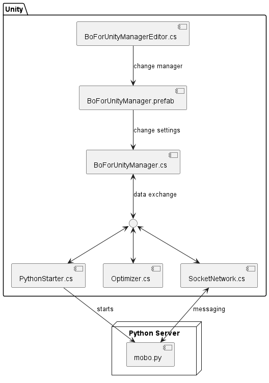

At the top is *BoForUnityManagerEditor.cs*, which edits the *BoForUnityManager.prefab* (what can be set and how it is described). The prefab’s settings are configured in the Unity Inspector as explained in [Configuration](#8-configuration).\
*BoForUnityManager.cs* manages the process and first starts the Python server via *PythonStarter.cs*.\
Once the server is running, *BoForUnityManager.cs* communicates with the selected backend script (*bo.py*/*mobo.py* or *cabop_bo.py*/*cabop_mobo.py*) using *SocketNetwork.cs*. On the Python side, all backends share the socket protocol, the init-message checks and the log writers in *bo_protocol.py*.\
After receiving data from *SocketNetwork.cs*, it passes it to *Optimizer.cs*, which updates simulation parameters.\
*BoForUnityManager.cs* also tracks the current iteration and orchestrates the loop.

<br>

## 11. Portability to Your Own Project

To reuse this tool in another project, export it as a Unity package:
1. In the Unity hierarchy, ensure you are in *Assets*.
2. `Assets` → **Export Package...**
3. Click **None** to deselect all files.
4. Select:
   - *BOforUnity*
   - *QuestionnaireToolkit*
   - *StreamingAssets*
5. Click **Export...** and save the package.

To import: `Assets` → **Import Package** → **Custom Package...**, select your package, keep all selected, and press **Import**.

> **Note:** Avoid spaces in the project path; otherwise, the Python script may not resolve paths correctly.

> **Note:** On first use of *TextMeshPro*, install *TextMeshPro-Essentials* when prompted. Refresh the scene if needed.

<br>

## 12. Citation

If you use this software, please cite:

```bibtex
@software{jansen_bayesian_optimization_for_unity,
  author    = {Pascal Jansen and Mark Colley},
  title     = {Bayesian Optimization for Unity},
  publisher = {Zenodo},
  doi       = {10.5281/zenodo.19786494},
  url       = {https://doi.org/10.5281/zenodo.19786494}
}
```


<br>

## 13. License

This project is under the **MIT License**, available in the repository folder containing this README.
