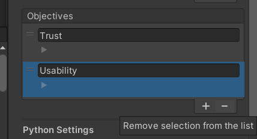

# Bayesian Optimization for Unity

by [Pascal Jansen](https://scholar.google.de/citations?user=cR1_0-EAAAAJ&hl=en) and [Mark Colley](https://scholar.google.com/citations?user=Kt5I7wYAAAAJ&hl=de)

## Related Publications
* [OptiCarVis: Improving Automated Vehicle Functionality Visualizations Using Bayesian Optimization to Enhance User Experience](https://arxiv.org/abs/2501.06757)
(CHI '25, Best Paper Honorable Mention, top 5%)

* [Improving External Communication of Automated Vehicles Using Bayesian Optimization](https://arxiv.org/abs/2501.10792)
(CHI '25)

* [Fly Away: Evaluating the Impact of Motion Fidelity on Optimized User Interface Design via Bayesian Optimization in Automated Urban Air Mobility Simulations](https://arxiv.org/abs/2501.11829)
(CHI '25)

## Table of Contents
* [About](#about)
* [Process](#process)
* [Versions](#versions)
* [Installation](#installation)
* [Example Usage](#example-usage)
* [Demo Video](#demo-video)
* [Configuration](#configuration)
    * [Parameters](#parameters)
    * [Objectives](#objectives)
    * [Python Settings](#python-settings)
    * [Study Settings](#study-settings)
    * [Warm Start & Perfect Rating Settings](#warm-start--perfect-rating-settings)
* [System Architecture](#system-architecture)
* [Portability to your own Project](#portability-to-your-own-project)
* [Known Issues](#known-issues)
* [License](#license)

## About

This Unity asset integrates Bayesian Optimization (BO) (based on [botorch.org](https://botorch.org/)) into your projects, enabling the optimization of design parameters to maximize or minimize objective values. It utilizes a [Human-in-the-Loop](#human-in-the-loop-process) approach, iteratively refining design parameters based on explicit or implicit user feedback.

#### Key Features
- Configuration of optimization hyperparameters directly in Unity.
- Automatic communication between Unity and the Python process running the BoTorch-based implementation.
- Integration of the [QuestionnaireToolkit](https://assetstore.unity.com/packages/tools/gui/questionnairetoolkit-157330) for user feedback.

#### Example Use Case

Optimizing the usability of an interface design. For this, we could employ the System Usability Scale (SUS) and measure interaction duration. This data can then be used to optimize the user interface.

## Process

#### Optimization Problem

In Multi-Objective Bayesian Optimization (MOBO), the goal is to find the optimal configuration of parameters (e.g., design parameters like color, transparency, and visibility). This optimal configuration maximizes the objective function values (e.g., objectives like usability or trust) while respecting the constraints of the design space ($`X`$), which contains all possible sets of parameters. This involves exploring a feasible design space to identify the best trade-offs among multiple objectives.

The optimization problem is represented as:

$$
x^* = \arg\max_{x \in X} f(x),
$$

where:
- $`x`$ is a vector of parameters within the feasible design space $`X`$,
- $`f(x)`$ represents a vector of objective functions, $`f(x) = [f_1(x), f_2(x), \dots, f_k(x)]`$, where $`k`$ is the number of objectives,
- $`x^*`$ is the optimal configuration of design parameters that maximizes $`f(x)`$ across all designs in $`X`$.

In this context, $`f(x)`$ is referred to as $`y`$. It represents the outputs or reactions of the user to the system being optimized (e.g., answers to questionnaires). This formulation ensures that the optimizer seeks to identify the parameter vector $`x^*`$ leading to the best possible outcomes for the given objectives.

#### Human-in-the-Loop Process
The picture below shows the human-in-the-loop (HITL) process for this asset.
This process can be explained step by step:
1. **Design Selection:**
The optimizer selects the design instance $`x`$. This is one set of parameters from the design space ($`X`$) containing all possible sets of parameters. In this example, a design instance includes the color (ColorR, ColorG, ColorB), the transparency and the visibility of the shapes (Cube & Cylinder). The parameters also have a set range to limit the design space size ($`X`$).
2. **Simulation:**
The appearance parameterized by $x$ is visualized in the simulation, allowing the user to experience the design.
3. **User Feedback:**
After the simulation, the user can subjectively rate the given design instance by completing the questionnaire. Then, the ratings are translated into objective function values $`y`$. In this example, the objectives are trust and usability, which also have a range to limit the size of the objective functions ($`Y`$).
4. **Optimization:**
Based on the current objective function values, the [Multi-Objective Bayesian Optimization (MOBO)](#multi-objective-bayesian-optimization-mobo) selects another design instance, considering all previous feedback. The loop then restarts.

#### Phases
The entire process is divided into two phases, during which the full HITL process occurs.

* **Sampling Phase (N Initial):**\
In this phase, the optimizer selects a design instance using Sobol sampling (see the note below). Sobol sampling systematically divides the design space into evenly distributed areas and selects one representative configuration from each area. The optimizer stores the objective function values to understand the design space and collect more values following optimization rounds. This means that there is no relation between the change in the visual appearance and the rating in these rounds.
\
The length of the sampling phase is determined by the number of initial rounds (N Initial). This is a [hyperparameter](#bo-hyper-parameters) that can be set in the Unity inspector, as explained later.

    > **Note:** I. M. Sobol. 1967. On the distribution of points in a cube and the approximate evaluation of integrals. U. S. S. R. Comput. Math. and Math. Phys. 7 (1967), 86–112. ([DOI](https://doi.org/10.1016/0041-5553(67)90144-9))

* **Optimization Phase (N Iterations):**\
In this phase, the optimizer balances between **exploitation** (refining known good configurations) and **exploration** (searching in new areas of the design space).
\
The length of the optimization phase is determined by the number of optimization rounds (N Iteration). This is also a [hyperparameter](#bo-hyper-parameters) that can be set in the Unity inspector, as explained later.

#### Questionnaires for User Feedback
To utilize the HITL optimization, this asset requires the [QuestionnaireToolkit](https://assetstore.unity.com/packages/tools/gui/questionnairetoolkit-157330) to collect explicit subjective feedback from users. This feedback serves as design objective value in the optimization process.

> **Note:** For the implicit approach, the questionnaire is replaced by the implicitly collected values.

#### Multi-Objective Bayesian Optimization (MOBO)

MOBO is an extension of BO designed to optimize multiple conflicting objectives simultaneously. Instead of seeking a single optimum, the goal is to identify a **Pareto front** representing the solutions that offer the best trade-offs between objectives.

For a solution to lie on the Pareto front, it must be **Pareto optimal**, stating that no other solution in the design space achieves better results for one objective without worsening another. This can be visualized in the following diagram. 

The x-axis illustrates the first objective (usability,) whereas the y-axis shows the second objective (trust). As depicted in the [HITL diagram](#hitl_diagram), both axes represent the objective function values ($`y`$). Each point on the diagram represents one set of $`y`$ from the objective functions ($`Y`$).
Points on the curve represent Pareto optimal solutions, while points inside the curve are suboptimal and dominated by the points on the front.

MOBO uses surrogate models (e.g., Gaussian processes) to create a simplified representation of the objective functions. This helps the optimizer to predict results for different design instances without having to compute them directly each time. Afterwards, a learning function (e.g., Expected Hypervolume Improvement) uses this model to decide which points to test next, focusing on improving performance and exploring promising areas in the search space.

To sum it up, the optimizer tries to maximize $`y`$ by selecting the expected best-fitting vector of parameters for the next round.

MOBO is widely used in areas such as hyperparameter tuning, material design, and engineering optimization, where multiple objectives must be satisfied simultaneously.

<!--#### Limitations-->

## Versions
There are currently three sample versions of the Bayesian Optimization for Unity project. They are divided into branches.

#### Main-Branch
This version is based on one Unity scene, i.e., no real scene changes. Instead, the interface is replaced by the next one in the same Unity scene.

#### Multi-Scene-Branch
The second version is based on multiple Unity scenes, meaning that every time you see a new interface, Unity switches to a different scene. To make this work, there is a loading scene during the optimization process, and the *BOforUnityManager* is marked as *DontDestroyOnLoad*.

#### HeartRateReceiver-Branch
This is an implicit version of the BO for Unity. It uses implicit data as objectives in the HITL process (e.g., live smartwatch data from the proband).

## Installation
Follow these steps to set up the asset on your system:
1. Clone the repository 
2. Run the installation_python.bat (or the install_python.sh for macOS) to install Python and the library requirements.
These files are located in *Assets/StreamingAssets/BOData/Installation*
3. Download & install the Unity Hub
4. Create or login to your (student-)licensed Unity account
5. Install Unity 2022.3.21f1 or higher
6. Add the project to the Unity Hub by selecting the repository folder
7. Open the project and set the [Python Settings](#python-settings) accordingly

> **Note:** You need to set the Python path manually, whether you installed it with the install file or have Python already installed locally. How to set the path correctly is explained in the [Python Settings](#python-settings) chapter. Be sure to also read the first section of [Configuration](#configuration) to ensure that you successfully save your Python settings.

## Example Usage
This chapter explains this asset by going through the demo experiment step-by-step.
You must install the Asset correctly and set the Python path in Unity.
> **Note:** To work, the *ObservationPerEvaluation.csv* must be empty (except for the header row). It can be found in *Assets/BOforUnity/BOData/BayesianOptimization/LogData/<USER_ID>/* (replace <USER_ID> with the set [User ID](#study-settings)). You can also delete the folder completely which will create a new clean folder with the file in the process.

1. In Unity, open the *Assets/BOforUnity* folder. Double-click on the *BO-example-scene.unity* file to open the scene.
2. Press the play button (⏵) at the top center of the screen.
3. Press the `Next` button on the screen and wait for the system to load. Then press `Next` again.
4. Now, the simulation will be shown. In this case, you will see a maximum of two shapes with colors to evaluate.
5. When you are finished, you can press the `End Simulation` button. A questionnaire will appear asking you to rate the simulation.
6. Answer the questions accordingly and press `Finish` when finished. Now the optimizer will save your input and change the simulation parameters.
7. Press `Next` to start a new iteration. Now, the process begins again from step `3.` until the set number of iterations is reached. Then, the system tells you that you can now close the application.

> **Note:** The results of the experiment can be seen in *Assets/BOforUnity/BOData/BayesianOptimization/LogData/<USER_ID>/* (replace <USER_ID> with the set [User ID](#study-settings)).

## Demo Video
You can click on the thumbnail below for a short demo video illustrating how to export the BO-for-Unity package (main-branch) and import it into a new Unity project. It shows what you must do after importing if you have Python 3.11.3 installed locally and are using a Windows computer. Optionally, you can go to the *images* folder and watch the video there.

<!---->

## Configuration
All the necessary configurations can be done in Unity. To do this, open the Unity scene folder, which is *Assets/BOforUnity*. Double-click on the *BO-example-scene.unity* file to open the scene. Then select the *BOforUnityManager* object on the left (blue) and click on *Select* in the upper part of the inspector. Now, you can change the settings.

Be sure to save the scene after you have made your changes! Please check if your settings have been saved by clicking on the *BOforUnityManager* object on the left (blue) again and check the changed parameter. The prefab *BOforUnityManager* must be correct because it will override the previous settings, as seen in the inspector on the top left.

> **Note:** All possible configurations can be made in this object. The different possibilities are explained from top to bottom. You can follow along by scrolling down in the inspector on the right side of Unity.

#### Parameters
The parameters are optimized by the optimizer. In this configuration section, you can create, chang,e or remove such parameters.

##### Create Parameter
Click on the `+` symbol at the bottom of the parameter collection. A new prefilled parameter will appear,r which needs to be edited accordingly. How to edit it is explained [here](#change-parameter).

> **Note:** Make sure the added parameter is used in your simulation.

> **Note:** It is recommended to save the previous log files in *Assets/BOforUnity/BOData/BayesianOptimization/LogData/<USER_ID>/* (replace <USER_ID> with the set [User ID](#study-settings)) and then delete this folder to make sure that the header is correct.

> **Note:** Changing the header when adding a parameter is also crucial for the .csv files used by the optimizer when using the [warm start option](#warm-start-settings)!

##### Change Parameter
The adjustable options of each parameter are explained from top to bottom. You can see them in the inspector by clicking on a parameter's drop-down arrow, as shown in the [image](#parameter_settings) below.

| **Name**              | **Description**                                                                   |
|-----------------------|-----------------------------------------------------------------------------------|
| **Value**             | Displays the value assigned to the parameter by the optimizer after optimization. |
| **Lower/Upper Bound** | Sets a range to limit the values of the parameter.              |
| **Is Discrete**       | Indicates if the optimizer generates only discrete values for this parameter.     |
| **Step**              | Only relevant for discrete parameters; sets the step size (e.g., 1 allows all numbers, 2 allows even numbers, 3 allows every third number, etc.). |
| **Script Reference**  | Links to the parameter in Unity via the `UpdateParameter` method in the *Optimizer.cs* file. |
| **Variable Name**     | Identifies the correct parameter in Unity using the `UpdateParameter` method in the *Optimizer.cs* file. |
| **Game Object Name**  | Specifies the game object associated with the parameter when multiple game objects are optimized. |
| **Script Name**       | References the Unity script for locating the parameter through the `UpdateParameter` method in *Optimizer.cs*. |

> **Note:** The `UpdateParameter` method should not be used if possible because it often happens that the exact script can't be found even when setting the parameters above. Instead, get the needed value from the parameter list in the *BOforUnityManager* by selecting the correct index.

##### Remove Parameter
Select the parameter you want to delete by clicking on the `=` icon in the upper left corner of the parameter. Ensure it is highlighted in blue, as shown in the image below. Then click the `-` icon at the bottom of the parameter collection.

> **Note:** Make sure that the removed parameter is **not** used in your simulation.

> **Note:** It is recommended to save the previous log files in *Assets/BOforUnity/BOData/BayesianOptimization/LogData/<USER_ID>/* (replace <USER_ID> with the set [User ID](#study-settings)) and then delete this folder to make sure that the header is correct.

#### Objectives
The objectives are the inputs that the optimizer receives. You can create, change, or remove such objectives in this configuration section.

##### Create Objective
Click on the `+` symbol at the bottom of the objective collection. A new prefilled objective will appear, which needs to be edited accordingly. How to edit it is explained [here](#change-objective).

> **Note:** An objective must be given a value before the optimization step to make it work. In this demo, this can be done by creating a new question in the questionnaire or by changing a question for another objective to the new objective. How to do this is explained below.

> **Note:** It is recommended to save the previous log files in *Assets/BOforUnity/BOData/BayesianOptimization/LogData/<USER_ID>/* (replace <USER_ID> with the set [User ID](#study-settings)) and then delete this folder to make sure that the header is correct.

> **Note:** Changing the header when adding an objective is also essential for the .csv files used by the optimizer when using the [warm start option](#warm-start-settings)!

###### Create Question
In the hierarchy of the *BO-example-scene* go to *QTQuestionnaireManager/QuestionPage-1*. On the right side, you will see *Question Item Creation*. Select the inputs as needed (the *Header Name* must be the same as the corresponding objective name). Then click on *Create Item* and the question will be added. Now you can edit the question by following the next paragraph.

###### Change Existing Question
In the hierarchy of the *BO-example-scene* go to *QTQuestionnaireManager/QuestionPage-1/Scroll View/Viewpoint/Content/* and select the question you want to change. To make the question count for the new objective, the *Header Name* of the question must be the same as the objective name.

##### Change Objective
Adjustable options are explained from top to bottom. You can see them in the inspector by clicking on the drop-down arrow of an objective, as shown in the [image](#objective_settings) below.

| **Name**                       | **Description**                                                                                      |
|--------------------------------|------------------------------------------------------------------------------------------------------|
| **Number of Sub Measures**     | Specifies how many values exist for this object (e.g., the number of questions). Must be at least 1. |
| **Values**                     | Displays the values after the questionnaire is completed.                                            |
| **Lower/Upper Bound**          | Sets a range to limit the values of the objective.                                               |
| **Smaller is Better**          | Indicates whether smaller values are preferable (default is that higher values are better).          |

##### Remove Objective
Select the objective you want to delete by clicking on the  `=` icon in the upper left corner of the objective. Make sure it is highlighted in blue as shown in the image below. Then click on the `-` icon at the bottom of the objective collection.

> **Note:** Make sure you do the reverse of what you must do when adding an objective.

#### Python Settings
In the top section shown in this [image](#py_st_ws_pr_settings), you have to set the path to Python manually. To do this, you need to get the local path of **Python 3.11.3**.
* For Windows, you can enter a cmd terminal and type `where python`. This will list all installed Python versions. Now, you can copy the path to the correct version.
* For Linux or macOS, you can go into a terminal and type `whereis python3.11` or `which python3.11`. Now, you can copy the path.

Afterwards, you have to check the box in the *Python Settings* section of the *BOforUnityManager* if it is not checked and replace the default path with the copied path in the text box that appears. You do not need to remove anything from your path.

#### Study Settings
You can set individual study settings in the next section of the [image](#py_st_ws_pr_settings). Here, you can set the ID of the user (User ID), the ID of the current condition (Condition ID), and the ID of the current group (Group ID). This ensures sortable results.

#### Warm Start & Perfect Rating Settings
The following explanations refer to the lower part of this [image](#py_st_ws_pr_settings).

##### Warm Start Settings
* If you check the Warm Start box, the initial rounds will be skipped. As a result, from the first iteration on, the optimizer will start optimizing using the results of a previous study. The results of the previous study must be given as .csv files. They must have a certain shape, as seen in the example data in *Assets/BOforUnity/BOData/BayesianOptimization/InitData*. In addition, the *ObservationsPerEvaluation.csv* of the previous study must be copied into the log data of the new study (For the example warm start, you can copy the contents of the *ExampleObservationsPerEvaluation.csv* located in the *InitData* folder into the *ObservationsPerEvaluation.csv*).

* Leaving the box unchecked results in the default start. After the specified number of initial iterations (must be at least 2!), the optimizer uses all the collected values to start the optimization process.

> **Note:** To work, the format of the .csv files needed for the warm start **MUST** be the same as in the example csv files! Check the header to see what values are required. This also means that the number of parameters and targets in the .csv files provided for the warm start must match the number used for the optimization afterwards. This is automatically the case if you use the log data of a previous study (with the same settings!) as input files.

> **Note:** If you go back to the default start, make sure that the number of initial rounds is at least **2**!

##### Perfect Rating Settings

* The perfect rating is disabled by default (unchecked box).
* Perfect rating is enabled by checking the box. AS a result, the check for a perfect rating will be performed and the system will terminate if a perfect rating is achieved.
* If *Perfect Rating In Initial Rounds* is also checked (appears only when perfect rating is active), a perfect rating can also be achieved in the initial rounds (sampling phase).

#### BO-Hyper-Parameters 

BO-Hyper-Parameters control the behavior of the optimization process, such as the number of iterations, sampling strategies, and evaluation settings. These parameters influence how efficiently and effectively the optimizer searches for the best solution within the defined space. The adjustable hyperparameters are shown in this [image](#BO_hyper_settings).

| **Name**       | **Default Value** | **Description**                                                                                   | **More Information**                                                                                                   |
|-----------------|-------------------|---------------------------------------------------------------------------------------------------|------------------------------------------------------------------------------------------------------------------------|
| **N Initial**   | 5                 | Number of initial evaluations to gather before optimization begins. Also known as the length of the sampling phase.                              |                                                                                                                        |
| **N Iterations**| 10                | Number of iterations the optimizer will perform to refine the results. Also known as the length of the optimization phase.                               |                                                                                                                        |
| **Total Iterations** | 15           | Sum of `N Initial` and `N Iterations` representing the total number of iterations.               |                                                                                                                        |
| **Batch Size**  | 1                 | Number of evaluations performed in parallel during optimization.                                  | [Batch Size Explanation](https://mljourney.com/how-does-batch-size-affect-training/)                                      |
| **Num Restarts**| 10                | Number of optimization restarts to escape local optima and ensure better results.             |                 |
| **Raw Samples** | 1024              | Number of random samples taken to initialize the optimization process.                           |                                             |
| **MC Samples**  | 512               | Number of Monte Carlo samples used to approximate expected utility in BO.      | [MC Samples Explanation](https://www.sciencedirect.com/topics/mathematics/monte-carlo-simulation)                      |
| **Seed**        | 3                 | Seed value for random number generation to ensure reproducibility of optimization runs.           | [Seed Explanation](https://en.wikipedia.org/wiki/Random_seed)                                                          |

> **Note:** The number of initial rounds must be **at least 2!** Use the warm start option instead if you want to skip the initial rounds.

## System Architecture
This chapter explains the system architecture, making it easier for you to work with it as a base and develop the asset to meet your own needs. The system architecture can be explained with the following diagram.

At the top you can see the *BoForUnityManagerEditor.cs*, where you can edit the *BoForUnityManager.prefab*. So you can change what can be set there, how the descriptions for the settings look, and so on. The *BoForUnityManager.prefab* settings can be set via the *Unity Inspector* as explained in the [Configuration](#Configuration) chapter.\
The settings are used by *BoForUnityManager.cs,* which manages the whole process and is located in the middle of the diagram. It starts the Python server first with *PythonStarter.cs*.\
Once the Python server has been successfully started, *BoForUnityManager.cs* communicates with the *mobo.py* script running on the server. It does this based on the *SocketNetwork.cs* script.\
After receiving data from *SocketNetwork.cs* it passes it to *Optimizer.cs*, which updates the design parameters for the simulation.\
The *BoForUnityManager.cs*, script also checks which iteration is active and manages the process accordingly.

## Portability to Your Own Project
If you want to use this optimization tool in your own project, you can export it as a Unity package and import it into your project. To do so, follow these steps: 
1. Make sure you are in the *Assets* folder in the Unity project hierarchy. 
2. Click on `Assets` in the top menu and then on `Export Package`. 
3. Click `None` to deselect all files.
4. Select these three folders: *BOforUnity*, *QuestionnaireToolkit*, *StreamingAssets*.  
5. Click `Export...` and save the package. 

To include it in your project, return to `Assets` in the top menu and click `Import Package` → `Custom Package...`. Select the package you saved. Then, keep everything selected and press `Import`.

> **Note:** Make sure that your project path does not contain any spaces. Otherwise, the Python script cannot find the correct paths.

> **Note:** If this is a new project, or you have never used *TextMeshPro* in your project, a pop-up will appear to install *TextMeshPro-Essentials*. Install this as well to make the text boxes work. Refresh the scene afterwards to reload the text boxes if necessary.

## Known Issues
#### Python Warnings
During the experiment, the MOBO Python script may give warnings about normalizing the input objectives. Unity will treat these warnings as errors. However, these warnings can be ignored and do not affect the result of the optimizer as far as we know.

#### Multi-Scene - Warm-Start
If warm start is enabled in the multi-scene branch, the `Next` button to get to the first simulation will appear too early. This is not a big problem, you just have to wait for the initialization of the warm start data to be processed. Click the button a few seconds after it appears. If it still does not work, try again after a few more seconds.

## License
This project underlies the **MIT License**, which can be found in the folder where this README is located.

\
\
*README written by Sebastian Lommen*
